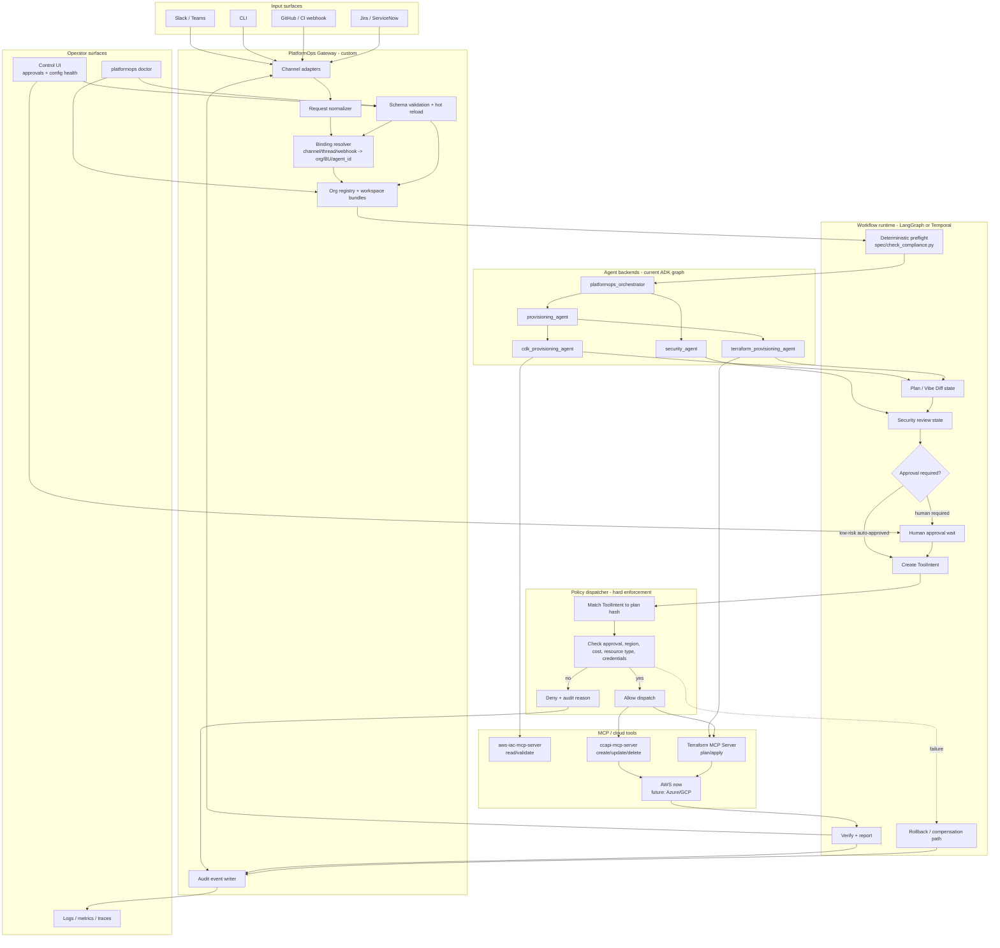

# Harness & Model Architecture — Design

## Status
This is a design document, not a build log. It describes where this project
is headed once it grows beyond the hackathon MVP: a **harness** (the
runtime that wraps agents with channels, sessions, and human review) and a
**model layer** (how agents pick which LLM backs them) that any team can
adopt and configure for their own org, not just run our specific demo.

Only the model-layer config described below has real code behind it today.
The Gateway/harness described below is design only — see "What's built vs.
designed" at the bottom for the exact line.

### Document map
This is the entry point; the following docs go deeper on specific slices
rather than repeating this one:
- `docs/current_architecture.md` — deep dive on the ADK agent graph and
  defense-in-depth layering **as built today**, with diagrams and direct
  code links, plus a worked example (Section 4) tracing one concrete
  request through what's real code versus what's still a prompt-level
  instruction. Read this for "how does the current hackathon build
  actually work, mechanically," not this file.
- `docs/harness_deep_dive.md` — the production harness design: the
  Brokered Tool Dispatcher pattern, OpenClaw-primitive mapping, and a
  comparison of Temporal/LangGraph/CrewAI as the workflow layer.
- `docs/planned_implementation.md` — the 5-phase build order for the spike
  described below in "What to implement first."
- `docs/ui_and_multitenancy_deep_dive.md` — analysis (not yet built) of a
  CopilotKit/AG-UI/A2UI channel for input and review, and the team-member
  layer underneath Org/BU — read this for "how does an individual person
  fit into a BU's shared workspace," which this file doesn't cover.
- `docs/skills_and_workspace_design.md` — analysis (not yet built) of what
  OpenClaw's workspace files (`AGENTS.md`, `USER.md`, `BOOTSTRAP.md`,
  `skills/`, ...) concretely become for PlatformOps, a bundled→org→BU
  skill precedence hierarchy, and the governance gate needed when an
  agent authors a brand-new infra pattern that might become a reusable
  skill — read this for "how do skills stay reusable across orgs while
  still allowing BU-specific overrides," which this file doesn't cover.
- `docs/end_to_end_flow_example.md` — a single worked example tracing one
  request through *all* of the above (CopilotKit input, org/BU/team
  resolution, skill-registry lookup, reuse-vs-author branch, approval,
  execution) in one ordered walkthrough, with a real-vs-design-only table
  per step — read this when you want the whole path in one place instead
  of assembled from the docs above.
- `docs/skill_submission_flow.md` — disambiguates two things both called
  "submission" elsewhere: submitting an infra *spec* (deterministic,
  every request) vs. submitting a *skill* (`SkillProposal`, human-reviewed,
  only on the no-match branch) — read this when "how does a skill get
  submitted and turned into infra" is unclear from the docs above.
- `docs/config_storage_backend.md` — resolves "where does workspace
  config/org registry actually live" (YAML vs. database vs. object
  storage), with a `DbConfigLoader` sketch — read this before actually
  building the org registry.
- `docs/harness_memory_design.md` — designs `memory/YYYY-MM-DD.md` and
  `MEMORY.md`, which existed only as unexplained lines in a directory
  sketch until now: a `MemoryEntry` schema, the human- vs. agent-authored
  trust split, and the "memory is context, never authority" rule that
  keeps it from becoming a compliance/approval bypass.
- `docs/session_memory_design.md` — maps skills/memory onto the classic
  session/episodic/procedural/long-term memory taxonomy, and designs the
  one concept with no prior analog anywhere in this project: session
  (working) memory — a `SessionState` schema, its relationship to ADK's
  own Session/Runner, and the "continuity, never authority" rule.
- `docs/skill_loading_and_enforcement_gap.md` — establishes that the
  *bundled* skill tier every other skill doc assumes as a working
  foundation isn't one yet: no code loads a `SKILL.md`'s content, no
  code enforces its `allowed-tools`, and one bundled skill isn't wired
  to any agent — read this before building precedence or authoring on
  top of skills.
- `docs/foundation_app_layering_and_iam_tiers.md` — designs the
  compute workloads `README.md`'s roadmap explicitly scopes out today:
  a foundation layer (VPC/EKS, always human-approved) vs. an app layer
  (Lambda via CCAPI/Terraform, or Helm-to-EKS as a new third execution
  backend), a three-tier IAM model with a permissions-boundary rule for
  `AWS::IAM::Role`, and a `FoundationRecord` dependency check the
  dispatcher needs since app deploys require their foundation to exist
  first.
- `docs/eks_helm_mcp_integration.md` — research (not design) resolving
  which MCP servers actually front EKS/Helm: `awslabs.eks-mcp-server`
  for foundation-layer cluster lifecycle (no Helm support), the
  separate `containers/kubernetes-mcp-server` for app-layer Helm
  deploys — plus a new cross-BU kubeconfig-scoping risk this research
  surfaced.
- `docs/infra_discovery_and_platform_app_split.md` — research on
  discovering *existing* infra (not just creating it: `ccapi-mcp-server`'s
  broader `list_resources`, AWS Resource Explorer, Terraform-state-vs-
  live-API drift), corrects the IAM section above to four roles instead
  of three with a scoped-`iam:PassRole` rule, and adds the `TeamMember.scope`
  ("foundation" | "app" | "both") dimension the platform-team/
  application-team split needs.
- `docs/foundation_and_app_deploy_flow_example.md` — worked example (a
  platform engineer setting up a foundation, an app developer deploying
  onto it) tracing everything in the three docs above end to end, same
  role as `docs/end_to_end_flow_example.md` for this path.
- `docs/iam_permissions_boundary_implementation.md` — the concrete
  mechanism behind the "`AWS::IAM::Role` requires a permissions
  boundary" rule stated but never implemented above: the sourced,
  self-referential `ArnEquals` condition that forces a boundary at role
  creation and prevents its removal afterward, the new
  `infra/permissions-boundary-policy.json`/`iam-policy.json` artifacts,
  `WorkspaceBundle.permissions_boundary_arn`, and the dispatcher check —
  four defense-in-depth layers, not one.
- `docs/multi_cloud_foundation_and_iam.md` — extends the foundation/app/
  IAM design from AWS-only to GCP and Azure: a per-provider concept
  mapping (VPC/VPC-Network/VNet, EKS/GKE/AKS, IRSA/Workload Identity
  Federation/Azure AD Workload Identity), the finding that GKE's own MCP
  server is read-only (so foundation-layer creation should route through
  the already-integrated, provider-agnostic Terraform path rather than
  three divergent native integrations), confirmation that the Helm
  app-layer deploy is *already* provider-agnostic (renaming
  `deploy-to-eks` to `deploy-to-k8s`), and a `CloudIAMAdapter` pattern
  for enforcing the same abstract IAM rules through each provider's own
  mechanism (since corrected: GCP/Azure have no identity-attached
  boundary object at all — the ceiling comes from org/policy-scoped
  guardrails instead, see that doc's correction note).
- `docs/account_vending_machine_design.md` — answers
  `docs/multi_account_per_bu_design.md` Part F's open item with real
  research: AWS's Account Factory for Terraform's actual pipeline shape
  (GitOps request → SQS batching → Step Functions → a fresh per-account
  execution role), mapped onto minting a `CloudAccountBinding` — and the
  honest finding that no cross-cloud equivalent exists (Crossplane
  provisions resources *within* an account, not the account itself),
  so GCP/Azure vending has to be built from scratch, sketched but not
  verified.
- `docs/multi_account_per_bu_design.md` — corrects "one BU = one AWS
  account/GCP project/Azure subscription" to what real multi-account
  practice actually looks like: a BU can hold several accounts (dev/
  staging/prod, region-specific, or genuinely multi-cloud), the
  invariant is only that no account is ever *shared across BUs*.
  `CloudAccountBinding` replaces `WorkspaceBundle`'s flat single-account
  fields; `FoundationRecord` and discovery both move from per-BU to
  per-binding granularity.
- `docs/compute_paradigm_layering.md` — names what every prior "compute
  layer" doc implicitly assumed: Kubernetes is one compute paradigm
  among four (VMs, managed containers, serverless), each with a
  different foundation-dependency shape — for serverless the network
  layer is optional, and only Kubernetes's identity is shared enough to
  need its own `FoundationRecord` rather than collapsing into an
  attribute of the compute record. Also finds the generic tools already
  integrated (`ccapi-mcp-server`) cover EC2/Lambda already — the gap was
  the allow-list, not the tooling.
- `docs/foundation_layer_decomposition.md` — disambiguates the four
  different things this project has called a "layer," then decomposes
  "the foundation layer" (previously one atomic `FoundationRecord`)
  into a real network → compute → identity dependency chain, a
  recursive dispatcher check to match, a reverse-dependency check
  before decommissioning, and per-layer (not per-foundation) discovery
  — including a worked mixed-provenance example.
- `docs/control_ui_approval_queue_design.md` — turns the "Control UI"
  section below from a five-view shopping list into a real design:
  the `pending_approval:*` state machine unifying both approval paths
  into one queue, a self-review-prevention rule this project never had
  (`ApprovalRecord.human_reviewer` must never equal the requester),
  `review_policy.approval_mode` (any-of-N vs. unanimous), per-
  `FoundationRecord` dispatch serialization, and AG-UI's actual
  snapshot+JSON-Patch update mechanism — grounded against HCP
  Terraform's run queue and GitHub's required-reviewers pattern.
- `docs/external_ticket_approval_integration.md` — gives concrete
  design to the "Jira/ServiceNow" channel mentioned but never
  elaborated above: two modes (harness creates the change ticket vs.
  requester references an already-approved one), why neither system's
  MCP surface can drive the approval gate synchronously (both have
  confirmed async-workflow limitations), and the central rule —
  `ticket_scope_verified` is only ever set by a structured-field match
  against `plan_hash`, never inferred from ticket text.
- `docs/foundation_discovery_and_creation_chat_walkthrough.md` — an
  annotated chat transcript (discovery of an existing foundation, then
  standing up a new one from scratch) making concrete what no prior doc
  did: the literal content of `PlanRecord.plan_text` for a foundation-
  layer request — a Terraform module-instantiation block or a generated
  CloudFormation template, not just "a plan gets drafted."
- `docs/iac_based_discovery.md` — closes the GCP VPC-discovery gap by
  reusing infrastructure already built (`terraform-mcp-server`,
  `WorkspaceBundle.tfe_workspace`) plus one new finding (GCP Config
  Connector, readable through the same `kubernetes-mcp-server` already
  planned for Helm) — and corrects the assumption that live API
  discovery is primary: IaC state should be queried first when a BU has
  a registered `IacSourceRef`, since it carries declared intent live
  discovery can't recover, for all three clouds, not just GCP.
- `docs/foundation_discovery_and_capability_matching.md` — closes the
  gap left in the worked example above: what happens when discovery
  finds an *existing* foundation (reuse + load `discovered_capabilities`
  to pick a compatible app stack) or an *unmanaged* one (requires an
  adoption review at the same bar as creating one — "found" isn't
  "trusted"), plus a per-provider discovery-tooling table (AWS/Azure
  solid, GCP has a confirmed gap for VPC-level discovery specifically).
- `docs/flow_step_spec_decomposition.md` — extends spec-driven
  development to pipeline-stage granularity: one spec file per harness
  flow step (`spec/flow_steps/01`–`08`), each with an input/output
  contract and Given/When/Then scenarios, reusing the flow already
  enumerated above and the schemas in `harness/schemas.py`. States
  plainly that neither course source deck covers this decomposition —
  it's this project's own extension, not taught material.
- `docs/repo_layout_references.md` — the single consolidated index of
  every source (5 course PDFs + two web-research passes) behind
  `AGENTS.md`, `CLAUDE.md`, `spec/flow_steps/`, and this project's
  documentation conventions — read this first if you want "why is the
  repo laid out this way" in one place instead of per-doc citations.
- `docs/course_concepts_and_project_structure.md` — traces `AGENTS.md`
  and `CLAUDE.md` (project root) back to the five-day course material
  they were built from, flags that ADK may already have a native
  `SkillToolset` mechanism that could resolve
  `docs/skill_loading_and_enforcement_gap.md` without hand-building a
  loader (unverified — `google-adk` isn't installed here), and audits
  the existing `SKILL.md` files against the course's canonical format.
- `docs/spec_driven_development_scaling.md` — this project states its
  own methodology as spec-driven, but none of the foundation-tier/IAM-
  boundary/`TeamMember.scope` rules designed above exist as checkable
  `reference_architecture.md` scenarios, only as doc prose. Redesigns
  `spec/check_compliance.py` from one flat function into a
  `ComplianceRule`/`ComplianceContext` registry (the same pluggable-
  implementation pattern as `CloudIAMAdapter`), adds a second
  Given/When/Then vocabulary for context-shaped rules (who's asking,
  what already exists) alongside the existing spec-content-shaped one,
  and adds `PlanRecord.spec_version_checked` for spec provenance.
- `harness/` — real, tested code for the schemas and dispatcher (see
  `tests/test_harness.py`), the first slice of the design below.

## Why a harness, and why OpenClaw's pattern

Right now, `agents/orchestrator.py` is invoked directly — one process, one
session, one requester, no persistent identity across requests. That's fine
for a hackathon demo and wrong for a real platform-ops tool: real usage
means multiple teams, multiple concurrent requests, requests arriving from
wherever people already work (Slack, a ticket, a CLI), and a human
sometimes needing to see and approve a pending action before it runs.

[OpenClaw](https://docs.openclaw.ai/) solves a structurally similar problem
for coding agents: a **single Gateway process** as the source of truth for
sessions, routing, and channel connections, sitting between many input
surfaces (Discord, Slack, Telegram, WhatsApp, Signal, iMessage) and
whichever agent backend does the actual work, with per-sender/per-workspace
session isolation and multiple output surfaces (control UI, CLI, mobile).
We're borrowing that shape, not its code — our Gateway talks to our own
ADK agent tree instead of a coding agent, and adds a review-queue concept
OpenClaw doesn't need (approving cloud-infra changes, not approving code
edits). See "Deep dive: mapping onto OpenClaw's actual primitives" below for
exactly how that borrowing works once you look past the marketing diagram
and into OpenClaw's real data model.

## Model layer design

### Design goals
1. No agent's model choice should be a hardcoded string buried in Python —
   an adopting org should be able to point any agent at a different model
   without touching agent logic.
2. Different agent roles have different stakes and different ideal
   cost/capability tradeoffs — routing decisions are cheap and frequent;
   security review is rare and high-stakes. One model for everything is
   the wrong default, not a simplification.
3. Deterministic checks (`spec/check_compliance.py`) stay deterministic —
   the model layer governs *agents*, not the parts of the system that
   shouldn't be probabilistic in the first place.

### Role-based model tiers (recommended defaults)
| Role | Example agents | Tier rationale |
|---|---|---|
| Routing | `provisioning_agent` (router) | High volume, low ambiguity — cheapest capable model |
| Execution | `cdk_provisioning_agent`, `terraform_provisioning_agent` | Needs tool-use reliability; mid tier |
| Review | `security_agent` | Low volume, high stakes, worth the most capable available model |

### Config-driven model selection (implemented)
`config/models.yaml` maps agent role → model identifier. Agents load their
model from this file via `agents/model_config.py` instead of hardcoding a
model string. This is real, working code as of this design — see that file
for the current mapping. Swapping a model for an org's preferred one is a
one-line config edit, not a code change.

### Path to true model-agnosticism (designed, not built)
The current config still assumes Gemini-family model identifiers. ADK
supports non-Gemini models via a LiteLLM-style adapter in newer releases —
**verify this against the installed google-adk version's docs before
relying on it**. The next step is making `model_config.py` return a model
*handle* constructed through whatever adapter the configured identifier
implies (a `gemini-*` string vs. an `openai:*` / `anthropic:*` prefix, for
instance), so an adopting org isn't locked into Gemini just because we
started there.

### Current model implementation deep dive
The model layer is intentionally narrow today:

- `config/models.yaml` maps four roles to model identifiers:
  `routing`, `execution`, `review`, and `orchestration`.
- `agents/model_config.py#get_model(role)` loads that YAML and returns the
  configured `model` string for the requested role.
- Each ADK agent calls `get_model(...)` at construction time:
  `platformops_orchestrator` uses `orchestration`,
  `provisioning_agent` uses `routing`, both provisioning sub-agents use
  `execution`, and `security_agent` uses `review`.

That gives us the most important MVP property: model choice is no longer
buried in individual agent files. The boundary is still not a full model
abstraction, though. There is no schema validation, no per-BU override
mechanism, no runtime reload, and no provider adapter selection yet.
`get_model()` returns a raw ADK-compatible string, not a provider-neutral
model object. This is acceptable for the hackathon slice and exactly the
part to replace when the Gateway starts loading per-BU workspace config.

## Current agent implementation
The code that exists today is an ADK agent graph, not the production
Gateway/harness described below — see `docs/current_architecture.md` for
the full breakdown (agent topology diagram, request lifecycle, and the
4-layer defense-in-depth guardrail chain), rather than repeating it here.
Short version: routing, execution, and review are separate ADK agents with
different model tiers; `security_agent` has zero mutating tools; the
enforcement gap is that mutating MCP tools are still attached *directly* to
the provisioning agents, and the approval rule is a prompt instruction, not
yet a runtime guard.

### PlatformOps runtime boundary to build next
The next implementation step is not a UI; it is a small runtime boundary
that turns prompt-level procedure into enforceable workflow. Status as of
the harness spike in `harness/` (see `tests/test_harness.py` for proof it
works):

1. **Built**: typed schemas for the envelope, workspace bundle, plan,
   approval, and tool intent — `harness/schemas.py`.
2. **Partially built**: config loading + referential-integrity/uniqueness
   validation for bindings and workspace bundles —
   `harness/config_engine.py`. Not yet built: resolving org/BU into a full
   *org registry* (today it's one flat `config/bindings.yaml`, no
   org-level grouping on top).
3. **Not yet built**: loading per-BU workspace config (credentials, cost
   ceiling, model overrides, review policy) into the actual agent run —
   the schema and config loader exist, but nothing wires them into
   `agents/orchestrator.py` yet.
4. **Not yet built**: running `spec/check_compliance.py` as a mandatory
   preflight step before the ADK agent graph runs, with results attached
   to what `security_agent` reviews.
5. **Built**: mutating-call brokering — `harness/tool_dispatcher.py`'s
   `BrokeredToolDispatcher.evaluate_intent()` denies by default and only
   allows a `ToolIntent` that matches a recorded, valid, non-tampered
   approval, has an allow-listed resource type, and matches the workspace
   bundle's region. Not yet built: actually intercepting `cdk_provisioning_agent`
   / `terraform_provisioning_agent`'s real MCP tool calls and routing them
   through this dispatcher — today it's tested standalone, not wired into
   the agent graph. See `docs/planned_implementation.md` Phase 3 for the
   concrete mechanism: pull the mutating `ccapi-mcp-server` toolset off
   the agent entirely, replace it with a non-executing
   `propose_tool_intent(...)` function tool, and have the Gateway call the
   real MCP tool only after the dispatcher approves — this is the single
   required item left in the spike, everything else here is done.
6. **Built**: approval as data, not chat text — `ApprovalRecord` plus the
   dispatcher's `approvals`/`audit_logs` SQLite tables.
7. **Built** (as the standalone dispatcher check): dispatch only proceeds
   on a matching, valid approval. **Not yet built**: this gating actually
   sitting between the agents and CCAPI/Terraform apply in a real run.

The single biggest remaining gap is #3/#5's "not yet wired into the agent
graph" — the schemas, config validation, and dispatcher logic are real and
tested in isolation, but `agents/orchestrator.py` doesn't call any of it
yet. That's the next slice, not a new design.

## Harness layer design (not built — this section is the design to build toward)

```
                     ┌─────────────────────────────────────────┐
                     │              Gateway (new)                │
                     │  single process: source of truth for      │
                     │  sessions, routing, channel connections    │
                     └─────────────────────────────────────────┘
   Input channels             │                    Output surfaces
 ─────────────────►           │           ◄─────────────────────
  Slack / Teams               │            Chat reply (same channel)
  CLI                         │            Control UI (approval queue)
  Webhook (CI/CD trigger)     │            Audit log / observability
  (future: Jira/ServiceNow)   │
                              ▼
                  ┌───────────────────────────┐
                  │   Session & Routing layer   │
                  │  binding: channel account →   │
                  │  agentId (= one Business Unit) │
                  │  org registry: org → [BU→agentId] │
                  └───────────────────────────┘
                              │
                              ▼
                  ┌───────────────────────────┐
                  │     Agent layer (built)      │
                  │  orchestrator → compliance    │
                  │  skill, provisioning router →  │
                  │  {cdk, terraform} agents,       │
                  │  security_agent                  │
                  └───────────────────────────┘
```

### Input layer (channels)
Each channel is a thin adapter that normalizes an inbound message into a
common request shape (requester identity, workspace, text, attachments)
and hands it to the Session & Routing layer. Slack first (most platform-ops
teams already live there), then a generic webhook adapter for CI/CD
triggers (a PR that changes an infra spec), then other chat platforms.

### Session & routing layer
Modeled directly on OpenClaw's binding/`agentId` primitives (see the deep
dive below for the exact mechanics): a channel account binds to an
`agentId`, and each `agentId` **is** one business unit's fully isolated
scope — workspace, auth, sessions. An org registry sits above this mapping
`org_id` to its set of BUs/`agentId`s. This layer is also where **per-BU
configuration** lives: which cloud account/credentials, which
`infra/allowed-resource-types.json`, which cost ceiling, which model tier
overrides apply. This is the single biggest thing that turns this from
"our demo" into "a tool other orgs configure for themselves" — see
Adoption story below.

### Agent layer
Unchanged from what's built — the Gateway is agnostic to what's behind it,
the same way OpenClaw is agnostic to which coding agent it routes to. A
different org could in principle swap in a different agent graph entirely
as long as it accepts the Gateway's request shape.

### Output surfaces
- **Chat reply**: the agent's response returns via the same channel the
  request arrived on.
- **Control UI (new concept, not in the current build)**: a web dashboard
  showing pending Vibe Diffs awaiting human review. Today,
  `security_agent` autonomously approves or rejects against static
  policy files. A production-grade harness should make that
  **configurable per resource-type risk tier**: low-risk resource types
  (e.g., an S3 bucket matching all naming/region/cost rules) can stay
  fully autonomous; higher-risk types, or anything the agent itself flags
  as borderline, route to a human reviewer in the Control UI instead of
  an auto-reject. This turns `security_agent` from a gate into a
  recommendation-plus-human-approval workflow where the operator wants it.
- **Audit log**: every approve/reject decision (already logged per the
  security-review-checklist skill's existing requirement) surfaces here,
  not just in application logs.

### Multi-tenancy: Org → Business Unit → isolation unit
A single Gateway deployment must serve multiple **orgs**, each with
multiple **business units**, without any mixing across either boundary —
not just "multiple teams" as a flat list. Concretely (see the deep dive
below for why this shape, not some other one):

- **Org** = a customer/tenant. Exists only in *our* config layer — OpenClaw
  has no native concept of it.
- **Business unit** = the actual isolation unit, mapped 1:1 onto an OpenClaw
  `agentId` (its workspace, auth profiles, and session store). This is
  non-negotiable: OpenClaw's isolation guarantee only exists at the
  `agentId` level, so a BU that shares an `agentId` with another BU is not
  actually isolated, regardless of what our own config layer claims.
- **Workspace config bundle** (credentials, `infra/allowed-resource-types.json`
  equivalent, cost ceiling, model tier overrides) attaches per BU
  (per-`agentId`), not per org — an org with three BUs on three clouds needs
  three bundles, not one.
- **Org registry** (new, not yet built): a config store mapping
  `org_id → [{bu_id, agentId, workspace_bundle_ref}]`, so onboarding a new
  org means minting one fresh `agentId` per BU and registering it here —
  never reusing an existing `agentId`, which is an OpenClaw hard rule (see
  deep dive).
- **Team member** (the layer underneath BU): distinguished at the
  session/request level via `RequestEnvelope.channel_user_id`, **not** at
  the workspace level — OpenClaw's `agent-workspace` docs confirm the
  workspace (persona, memory, instructions) is one-per-`agent_id`, shared
  by everyone in that BU, not one-per-person. See
  `docs/ui_and_multitenancy_deep_dive.md` for the full reasoning and a
  real gap this surfaces: `harness/tool_dispatcher.py`'s audit log
  currently doesn't record `channel_user_id`, only `org_id`/`bu_id`.

## PlatformOps harness deep dive: features to borrow from OpenClaw

OpenClaw is useful here because it treats the harness as the product
boundary: one Gateway owns channel ingress, routing, sessions, tools,
configuration, and operator surfaces. For PlatformOps, the same shape is
right, but the safety model has to be stricter because the agent is not
editing files in a workspace — it is proposing and applying cloud
infrastructure changes.

### Borrow: Gateway as the single control plane
OpenClaw's Gateway is the source of truth for sessions, routing, and
channel connections. PlatformOps should use the same control-plane pattern:
all Slack/Teams/CLI/webhook input enters the Gateway, and all agent runs,
plan records, approval records, mutation dispatches, and audit events are
created there.

PlatformOps adaptation:

- The Gateway owns the request envelope, not the ADK agent.
- The Gateway assigns `request_id`, `plan_id`, `org_id`, `bu_id`,
  `workspace_bundle_ref`, requester identity, and source channel metadata.
- The Gateway records each state transition: received, normalized,
  compliance-checked, planned, reviewed, approved/rejected, dispatched,
  verified, failed, or rolled back.
- Agents may draft plans and explanations, but they do not decide whether a
  cloud-mutating tool call is allowed to leave the process.

### Borrow: deterministic bindings, but map them to org/BU routing
OpenClaw bindings route inbound channel accounts/peers to an `agentId`,
with most-specific matches winning. PlatformOps should keep that
deterministic routing rule, but the target of routing is not a persona; it
is a business unit isolation scope.

PlatformOps binding shape:

```yaml
bindings:
  - match:
      channel: slack
      workspace_id: T123
      channel_id: C-platform-payments
    org_id: acme
    bu_id: payments
    agent_id: acme-payments

  - match:
      channel: webhook
      source: github
      repo: acme/payments-infra
    org_id: acme
    bu_id: payments
    agent_id: acme-payments
```

Validation rules to build:

- No binding may route two BUs to the same `agent_id`.
- DM fallbacks are disabled for production PlatformOps unless they resolve
  to exactly one BU and one reviewer policy.
- Channel/thread bindings must be preferred for shared Slack/Teams
  workspaces.
- A default route is allowed only in a single-BU sandbox deployment.

### Borrow: per-agent isolation, but do not treat it as tenant security
OpenClaw's `agentId` owns workspace files, auth profiles, model registry,
and session history. It also warns that one shared Gateway is a personal or
single-trust-boundary deployment, not a hostile multi-tenant security
boundary. PlatformOps should take both lessons seriously.

For a self-hosted single-company deployment, one Gateway can host multiple
BU scopes if everyone is inside the same organizational trust boundary and
each BU has separate credentials, sessions, policy files, and tool
permissions. For a managed SaaS deployment, orgs should not share one
Gateway trust boundary. Use one Gateway or one hardened runtime namespace
per tenant, backed by separate cloud credentials and storage.

Isolation levels:

| Level | Use | Boundary |
|---|---|---|
| BU scope | Teams inside one trusted org | Separate `agent_id`, workspace bundle, sessions, credentials, policy |
| Org scope | One customer/tenant | Separate Gateway/runtime namespace, registry rows, secret store prefix |
| Host scope | Mixed-trust or regulated tenants | Separate host, container namespace, service account, network policy |

The PlatformOps rule is stricter than OpenClaw's personal-assistant
default: never rely on `agent_id` alone for adversarial tenant isolation.
`agent_id` is the BU routing and workspace unit; tenant isolation belongs
to the deployment boundary and secret boundary.

### Borrow: schema-validated, hot-reloadable config
OpenClaw validates configuration strictly and refuses bad config at startup
or reload. PlatformOps should copy that behavior for org registry and
workspace bundles. A malformed binding or policy file should fail closed,
not fall back to a permissive default.

PlatformOps config families:

- `orgs.yaml`: org metadata and allowed domains/channels.
- `bindings.yaml`: channel/webhook/CLI route matches to org, BU, and
  `agent_id`.
- `workspace_bundles/*.yaml`: region, cloud account, credential reference,
  cost ceiling, allowed resource types, model overrides, and review policy.
- `review_policies/*.yaml`: which resource types can auto-approve, which
  require human approval, and which are always denied.
- `model_catalog.yaml`: provider/model IDs, role defaults, fallbacks, and
  org/BU overrides.

Startup/reload behavior:

1. Parse all config with a real schema.
2. Validate referential integrity: every binding points to an existing
   org, BU, workspace bundle, and agent ID.
3. Validate uniqueness: no cross-org reuse of agent IDs, credential refs,
   or mutable state paths.
4. Validate policy completeness: every mutating tool route has a review
   policy and audit sink.
5. Promote the config only after all checks pass.
6. Keep the last accepted config active if reload fails.

### Borrow: plugin and tool policy, but make mutation tools brokered
OpenClaw has plugin allow/deny policy, tool allow/deny controls, sandbox
settings, and runtime inspection. PlatformOps needs the same operator
visibility, but infrastructure mutation should be brokered by the Gateway
regardless of what the underlying ADK agent supports.

Do not attach mutating cloud tools directly to execution agents in the
production harness. Instead:

```
execution agent -> proposed ToolIntent -> Gateway policy dispatcher -> MCP/cloud tool
```

`ToolIntent` should include:

- `plan_id` and exact plan version hash
- org, BU, requester, and source channel
- target provider/account/region
- tool name and normalized action
- resource type, resource identifier, and operation
- expected diff and estimated monthly cost
- approval requirement and approval record ID

The dispatcher denies by default unless the intent matches an approved plan
and the workspace bundle permits the resource type, account, region, and
operation. This is the key difference between a demo agent graph and a
PlatformOps harness.

### Borrow: Control UI, but center it on review and audit
OpenClaw's Control UI covers chat, config, sessions, and nodes. PlatformOps
should have a Control UI too, but the main object is the Vibe Diff review
queue, not general chat.

Required PlatformOps Control UI views:

- Pending approvals: plan summary, risk tier, requester, BU, cost, region,
  resource types, and policy findings.
- Plan detail: raw structured diff, deterministic compliance results, MCP
  validation results, security-agent recommendation, and human comments.
- Audit log: immutable timeline of request, plan, approval, dispatch,
  verification, failure, and rollback events.
- Config health: active registry version, last reload, validation failures,
  missing policy coverage, stale credentials.
- Break-glass panel: time-limited manual approval or deny override, always
  requiring a human identity and reason.

### Borrow: health, doctor, and runtime inspection
OpenClaw exposes operational checks such as health, doctor, logs, metrics,
and plugin/runtime inspection. PlatformOps should expose equivalent checks
because a broken harness can either block deployments or, worse, allow
unreviewed mutation.

Minimum diagnostics:

- `platformops doctor`: validates config, credentials reachability, MCP
  server availability, policy coverage, and audit sink writability.
- `platformops bindings list --effective`: shows the exact route a Slack
  channel, Teams thread, CLI identity, or webhook source will take.
- `platformops plans inspect <plan_id>`: shows plan hash, policy result,
  approval state, and dispatch eligibility.
- `platformops tools inspect`: lists read-only tools, mutating tools, and
  which dispatcher policy gates each mutating action.
- Metrics: request latency, planning latency, review latency, dispatch
  latency, approval counts, denial reasons, failed validations, and policy
  reload failures.

### Borrow: plugin extensibility, but define a narrow PlatformOps plugin ABI
OpenClaw plugins can add channels, providers, tools, skills, hooks, and
runtimes. PlatformOps should support plugins, but only through narrow
interfaces that preserve the approval and audit boundary.

Plugin types to allow:

- Channel adapter: Slack, Teams, Jira, ServiceNow, GitHub webhooks.
- Provisioning backend: AWS CCAPI, Terraform, future Azure/GCP backends.
- Policy pack: resource allow-lists, cost estimators, compliance checks.
- Model provider adapter: Gemini, OpenAI, Anthropic, local provider.
- Notification sink: Slack reply, ticket comment, SIEM/audit export.

Plugin rules:

- Plugins can propose capabilities; the Gateway grants them explicitly.
- Mutating capabilities must be declared as such and routed through the
  dispatcher.
- Plugins cannot write org registry, workspace bundles, approvals, or audit
  records except through Gateway APIs.
- Plugin install/update should be version-pinned and policy-checked before
  the Gateway loads it.

### Source-informed design features we should adopt

| OpenClaw feature | PlatformOps adaptation | Why it matters |
|---|---|---|
| Single Gateway control plane | PlatformOps Gateway owns request, plan, approval, dispatch, audit | One enforcement point |
| Bindings with most-specific routing | Channel/thread/webhook to org/BU/agent ID | Deterministic tenant/BU routing |
| Per-agent workspace/session/auth | Per-BU workspace bundle and session store | Prevents accidental BU mixing |
| Strict config validation | Schema-checked org registry and policies | Fails closed on bad config |
| Plugin allow/deny policy | Narrow plugin ABI with declared capabilities | Extensible without bypassing review |
| Tool policy/sandboxing | Gateway-brokered mutation dispatcher | Converts prompt rules into runtime rules |
| Control UI | Approval queue plus audit/config health | Human-in-the-loop infra governance |
| Doctor/health/metrics | PlatformOps operational diagnostics | Makes the harness supportable |

## Similar open-source harnesses to use or borrow from

OpenClaw is the best fit for the outer harness shape, but it is not the
only useful open-source reference. PlatformOps should treat these projects
as composable design sources, not as mutually exclusive choices.

| Project | What it is best at | PlatformOps use | Fit |
|---|---|---|---|
| [OpenClaw](https://docs.openclaw.ai/) | Multi-channel Gateway, bindings, sessions, Control UI, plugin policy | Borrow the Gateway/channel/session/control-plane shape | Strong outer harness reference |
| [LangGraph](https://docs.langchain.com/oss/python/langgraph/overview) | Long-running stateful agent orchestration, persistence, interrupts, human-in-the-loop | Candidate workflow runtime for plan/review/apply state machine | Strong implementation candidate |
| [Temporal](https://docs.temporal.io/) | Durable workflow execution, replay, retries, long waits, event history | Candidate durable backbone for approvals, apply, verification, rollback | Strong reliability layer |
| [AutoGen](https://microsoft.github.io/autogen/stable/) | Event-driven multi-agent systems, AgentChat, MCP workbench, Docker executors, distributed runtimes | Useful for multi-agent conversation patterns and distributed worker ideas | Medium fit |
| [CrewAI](https://docs.crewai.com/) | Crews, flows, task processes, guardrails, callbacks, human-in-the-loop triggers | Useful for role/task modeling and controlled business workflows | Medium fit |
| [Semantic Kernel](https://learn.microsoft.com/en-us/semantic-kernel/overview/) | Enterprise SDK for connecting models to existing APIs/plugins with telemetry/hooks/filters | Useful plugin/function abstraction for existing enterprise APIs | Medium fit |
| [OpenHands](https://docs.openhands.dev/overview/introduction) | Agent server, browser UI, SDK, integrations, permissions/RBAC/budgeting in hosted editions | Useful reference for developer-facing agent workspace UX and server packaging | Low-to-medium fit |

### Recommended implementation stance
Use a layered design rather than picking one framework to own everything:

- **Gateway layer**: custom PlatformOps Gateway, heavily inspired by
  OpenClaw's channel adapters, bindings, config validation, Control UI, and
  runtime inspection. This layer is domain-specific because it owns org/BU
  routing, approvals, credentials, and audit.
- **Workflow layer**: use LangGraph or Temporal for the plan/review/apply
  lifecycle. LangGraph is a natural fit if the workflow remains agent-heavy
  and Python-native. Temporal is a natural fit if approval waits, retries,
  rollbacks, and exactly-once-ish operational behavior become the dominant
  concern.
- **Agent layer**: keep the current Google ADK agent graph initially. The
  Gateway should call it as one planning/review backend, not let it own
  mutation dispatch.
- **Tool layer**: continue using MCP servers for cloud reach, but expose
  mutating tools only through the Gateway policy dispatcher.
- **Observability layer**: model traces, workflow events, policy decisions,
  and cloud mutation results as one request timeline.

This doc leaves LangGraph vs. Temporal open. `docs/harness_deep_dive.md`
goes further with pros/cons for each against PlatformOps's specific needs
(long approval waits, retries, rollback) and lands on a firmer
recommendation — a layered Temporal-outer/ADK-inner topology — worth
reading before actually building the workflow layer.

### Visual architecture diagram



### How the flow works

1. A request arrives through Slack, CLI, webhook, or ticketing.
2. The Gateway normalizes it into a typed request envelope and resolves the
   effective org, BU, `agent_id`, workspace bundle, model overrides, and
   policy bundle through deterministic bindings.
3. The workflow runtime starts a durable request lifecycle and runs
   deterministic checks before invoking LLM agents.
4. The ADK agent graph drafts a plan and Vibe Diff, using read-only
   validation tools where possible.
5. The security agent reviews the plan, but approval is recorded as
   structured data in the workflow state, not just text in chat.
6. If policy requires a human, the workflow pauses and the Control UI shows
   the pending approval.
7. Any cloud mutation becomes a `ToolIntent`; the policy dispatcher checks
   the exact plan hash, approval, workspace policy, cost, region, resource
   type, and credential scope.
8. Only an allowed `ToolIntent` reaches CCAPI or Terraform apply. Every
   denial, dispatch, result, and verification step is written to audit.

### What to implement first
See `docs/planned_implementation.md` for the detailed 5-phase walkthrough.
Status against that plan:

1. ~~Define `RequestEnvelope`, `WorkspaceBundle`, `PlanRecord`,
   `ApprovalRecord`, and `ToolIntent` schemas.~~ **Built** — `harness/schemas.py`.
2. ~~Add config validation for bindings and workspace bundles.~~ **Built** —
   `harness/config_engine.py` (referential integrity + agent_id/BU uniqueness).
3. Wrap the existing ADK graph behind a `plan_request(envelope)` call. **Not
   built** — this is the actual next step.
4. ~~Move mutating MCP calls behind a local dispatcher function.~~ **Built**
   standalone — `harness/tool_dispatcher.py`'s `BrokeredToolDispatcher`, but
   not yet wired to intercept the real CCAPI/Terraform MCP tool calls the
   agents make.
5. ~~Add a file-backed or SQLite audit log before building the Control UI.~~
   **Built** — the dispatcher's `audit_logs`/`approvals` SQLite tables,
   proven in `tests/test_harness.py`.

## What's built vs. designed
| Piece | Status |
|---|---|
| Agent layer (orchestrator, routing, CDK/Terraform sub-agents, security agent) | Built |
| Model config file + loader | Built |
| `RequestEnvelope`/`WorkspaceBundle`/`PlanRecord`/`ApprovalRecord`/`ToolIntent` schemas | **Built** — `harness/schemas.py` |
| Config loader + binding/bundle validation | **Built** — `harness/config_engine.py`, tested |
| Brokered tool dispatcher (deny-by-default `ToolIntent` gate) | **Built** standalone — `harness/tool_dispatcher.py`, tested; not yet wired into the live agent graph |
| SQLite audit log | **Built** — part of the dispatcher, tested |
| Wrapping the ADK graph behind `plan_request(envelope)` | Designed, not built — the actual next step |
| True model-agnosticism (non-Gemini models) | Designed, not built |
| Gateway process, channel adapters, session/routing layer | Designed, not built |
| Control UI / human-in-the-loop approval queue | Designed, not built |
| Org → Business Unit → agentId multi-tenancy model | Partially built — `config/bindings.yaml` binds agent_id to org/BU with uniqueness enforced; no org-level registry grouping yet |
| Org registry + onboarding automation | Designed, not built |
| Custom PlatformOps Gateway (own runtime, not OpenClaw's) | **Decided direction** — see "Recommended implementation stance"; schemas/config/dispatcher exist, the Gateway process itself doesn't |

## Adoption story
A new org onboards by: registering itself in the org registry, minting one
fresh `agentId` (never reused) per business unit, binding each BU's
channel(s) to its `agentId`, and attaching a workspace config bundle per BU
— cloud credentials, `infra/allowed-resource-types.json`, cost ceiling,
optional model tier overrides. If a BU wants a new cloud or tool, that's
one new provisioning sub-agent following the existing pattern (a skill + an
MCP server routing table entry) — none of this touches the Gateway,
routing/binding layer, org registry, or Security Agent's review logic.

## Deep dive: mapping onto OpenClaw's actual primitives

The "borrow the shape" framing above undersells how specific OpenClaw's
actual data model is. This section is the result of reading its real docs
(`agent-runtime-architecture`, `plugins/sdk-overview`, `concepts/multi-agent`)
rather than inferring from the marketing page, and it changes some earlier
assumptions.

### The isolation unit is `agentId`, and it's flat
Per OpenClaw's own docs: *"An agent is the full per-persona scope: workspace
files, auth profiles, model registry, and session store."* Concretely, each
`agentId` owns:
- `~/.openclaw/workspace-<agentId>` — files, `SOUL.md`, `AGENTS.md`, `USER.md`
- `~/.openclaw/agents/<agentId>/agent` — auth profiles, model registry
- `~/.openclaw/agents/<agentId>/sessions` — chat history

This is **not hierarchical** — there's no built-in concept of an org
containing business units. That's why our Org/BU model above treats
`agentId` as the BU-level primitive and layers "org" entirely in our own
registry on top. **Hard rule from the docs, worth repeating verbatim**:
*"Never reuse `agentDir` across agents (it causes auth/session
collisions)."* Our org-onboarding process must always mint a new `agentId`
— reusing one to save setup steps is exactly the mistake OpenClaw warns
against, and would silently break tenant isolation.

### Routing is binding-based, most-specific-wins
*"A binding maps a channel account (e.g. a Slack workspace or a WhatsApp
number) to one of those agents."* Precedence, most to least specific:
exact peer (DM/group ID) → thread inheritance (`parentPeer`) → Discord
role+guild → guild/team ID → account ID fallback → channel-level wildcard
→ default agent. For our use case: **one Slack workspace per org is the
simplest binding**, with per-BU routing inside that workspace handled via
channel- or thread-level bindings mapped to each BU's `agentId`.

**Real risk this surfaces, not hypothetical**: *"Direct chats collapse to
the agent's main session key, so true isolation requires one agent per
person."* If two people from different BUs DM the bot without a binding
specific enough to separate them, they land on the same session. Our
Gateway design must enforce that BU-level bindings are always
channel/thread-scoped, never "whoever DMs this bot" — a config validation
rule to build, not just a recommendation to document.

### Superseded: "plug into OpenClaw's runtime" framing
An earlier version of this doc recommended building a plugin-harness that
would run inside OpenClaw's runtime. That was written before we'd read
`concepts/agent`, which states plainly: *"OpenClaw runs a single embedded
agent runtime — one agent process per Gateway... The embedded agent
runtime is OpenClaw-owned... share one integrated runtime surface."* That
contradicts the "plugin harnesses register additional runtime ids" reading
from `agent-runtime-architecture` — the more likely correct interpretation
is that "runtime ids" there means swapping which *CLI coding-agent*
backend answers prompts (Claude Code vs. Codex vs. a custom CLI), not
hosting an entirely separate multi-agent system like ours. **Do not build
toward a plugin-harness runtime ID** — that path was based on a misread,
not a confirmed extension point.

Three ways to relate to OpenClaw were considered once that was corrected:

1. **CLI Backend Plugin** (`api.registerCliBackend(...)`) — wraps
   *existing CLI tools*, translating arguments/config for a CLI that
   already exists. Would need an adapter shim CLI in front of our ADK
   graph. Declined: loses structured tool-call/session fidelity at the CLI
   boundary.
2. **Register PlatformOps as an MCP tool source on a real, running
   OpenClaw Gateway** — a genuine, low-integration-cost path found via
   `tools.catalog`'s *"already-discovered MCP server tools"* and the
   documented `mcp.servers` config (stdio `command`/`args` or remote
   `url`, with `toolFilter` allow-listing — the same shape we already use
   for `aws-iac-mcp-server` etc.). Gets channel adapters, bindings,
   Control UI shell, and audit logging for free. **Declined for now**: it
   ties PlatformOps to OpenClaw's roadmap/licensing and a Control UI built
   for personal-assistant chat, not infra-approval queues, which would
   need extending regardless. Worth revisiting if the custom Gateway build
   below turns out to be more work than it's worth.
3. **Build a fully custom PlatformOps Gateway**, using OpenClaw purely as a
   design reference (bindings, per-agent isolation, config validation,
   Control UI, plugin policy) — not running on its runtime at all. **This
   is the chosen direction** — see "Recommended implementation stance" and
   "What to implement first" above, which already describe this path in
   detail. Full control over the approval/dispatch model, no dependency on
   OpenClaw's runtime, more build work up front.

## Open questions / risks
- **Resolved**: where workspace config and the org registry live — split
  by deployment mode, YAML + git for self-hosted/single-org, a database
  (reusing the same store as `harness/tool_dispatcher.py`'s audit/approval
  tables) for managed SaaS with many orgs; object storage was considered
  and declined for this specific data. See `docs/config_storage_backend.md`
  for the comparison and a `DbConfigLoader` sketch. Still open within that:
  SQLite vs. Postgres for the managed case, and the YAML→DB migration path.
- How does the Control UI's human-approval path affect latency/UX for
  low-risk requests that would otherwise be instant? Needs the risk-tier
  threshold to be genuinely useful, not a rubber stamp.
- Org-onboarding automation (minting a fresh `agent_id`/BU scope,
  registering it in our org registry, wiring its workspace config bundle)
  doesn't exist yet — right now this would all be manual steps, which is
  fine for one org and wrong the moment there's a second.
- **Resolved**: whether to plug into OpenClaw's runtime or build our own
  Gateway — decided in favor of a custom Gateway (see "Superseded: 'plug
  into OpenClaw's runtime' framing" above for what was considered and
  declined, including a real MCP-registration path worth revisiting later
  if the custom build proves heavier than expected).
- Next concrete spike target, per "What to implement first": define the
  `RequestEnvelope`/`WorkspaceBundle`/`PlanRecord`/`ApprovalRecord`/
  `ToolIntent` schemas and wrap the existing ADK graph behind a
  `plan_request(envelope)` call — not any OpenClaw-runtime integration.
