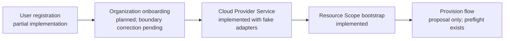

# PlatformOps implementation status

**Last reviewed:** 2026-09-25
**Purpose:** Cross-change review dashboard. This is a navigation and
status note, not a source of behavioral requirements. Each OpenSpec
change remains authoritative for its proposal, requirements, design,
and task checkboxes.

## How to use this note

OpenSpec has four durable artifacts for each change:

| Artifact | Captures |
|---|---|
| `proposal.md` | Why the change exists and its boundary |
| `specs/*/spec.md` | Required externally observable behavior |
| `design.md` | The chosen technical approach and tradeoffs |
| `tasks.md` | Implementable work and its completion evidence |

Use the linked `tasks.md` files for the current, granular progress.
Update this document only when a cross-change milestone or the recommended
delivery order changes.

## Delivery view

The arrows show the intended dependency order. They do not mean that an
earlier workflow grants access to a later one: every stage remains
deny-by-default and must explicitly resolve its own trusted context.

## Change status

| Change | Planning state | Implementation state | Review / next step |
|---|---|---|---|
| [User registration](../openspec/changes/build-user-registration/) | Proposal, specs, design, and tasks complete | PostgreSQL identity records, deterministic `/login`, scanner-safe confirmation, unassociated browser session, and domain/IdP journeys are implemented and verified | Keep organization claims, memberships, tenant IdP/SCIM configuration, and cloud connection in their separate changes |
| [Organization onboarding](../openspec/changes/build-org-onboarding/) | Proposal, spec, design, and tasks complete; cloud/provider ownership corrected 2026-09-23 | In-memory lifecycle plus PostgreSQL migration/repository/integration coverage are complete; `/onboard-org` starts the PostgreSQL-backed deterministic graph and waits for review | Add the trusted review/resume path before marking the deployed PostgreSQL runtime replacement complete; real DNS/IdP proof remains a separate slice |
| [Control-plane command router](../openspec/changes/build-control-plane-command-router/) | Proposal, spec, design, and tasks complete | Explicit allow-list and validated issuer/subject principal are implemented; `/login` and `/onboard-org` handlers are wired | Add later `/join-org` and `/provision` handlers only when their own workflow prerequisites exist |
| [Organization member onboarding](../openspec/changes/build-organization-member-onboarding/) | Proposal, spec, design, and tasks complete | PostgreSQL membership/invitation records, deterministic `/join-org`, active-membership lookup, and revoked-member provision denial are implemented | Add tenant IdP/SCIM synchronization only through a separate deterministic adapter change; membership alone still grants no Resource Scope or cloud access |
| [Cloud Provider Service](../openspec/changes/build-cloud-provider-service/) | Proposal, four capability specs, design, and tasks complete | Tasks 1–5 complete using deterministic fake adapters: connection verification/inquiry, read-only discovery, reviewed attachment, and separately authorized container bootstrap | Keep live provider adapters disabled. Add a live adapter only as a separate verified implementation slice with current official-provider validation |
| [Resource Scope bootstrap](../openspec/changes/build-resource-scope-bootstrap/) | Proposal, three capability specs, design, and tasks complete | Durable PostgreSQL scope/binding registries, deny-by-default access and governance evaluators, legacy edge normalization, and non-mutating resolved-context preflight are implemented | Keep scope/bootstrap administration and cloud-container attach/create workflows separate; integrate the resolved preflight through the provision-flow change |
| [Provision flow](../openspec/changes/build-provision-flow/) | Proposal, spec, design, and tasks complete | Authenticated gateway handoff, deterministic active-membership/scope/binding preflight, sealed plan/policy approval, checkpointed reviewer separation, and fake-only execution evidence are implemented | Wire a reviewed live provider executor only in a separate, provider-validated change; this change supplies none |

## Confirmed vocabulary and security boundaries

| Term | Meaning |
|---|---|
| **Principal** | An authenticated user, identity group, or service principal that asks for an action |
| **PlatformOps Resource Scope** | The logical authorization context: `org:…:bu:…:team:…:project:…:env:…` |
| **PlatformOps Project** | A logical governance container, independent from a cloud-provider project, account, or subscription |
| **Cloud Resource Container** | An AWS account, GCP project, or Azure subscription |
| **Provider Binding** | A trusted mapping from a Resource Scope to a Cloud Resource Container and execution identity; never accepted from a client token/request |
| **Deployment Destination** | Runtime location inside a container, such as an EKS namespace or Cloud Run service; separate from the Resource Scope |

An authenticated login establishes a principal only. It does not establish
organization membership, Resource Scope access, a provider binding, or cloud
execution authority.

## Recommended next review sequence

1. Add configured organization-IdP routing for matching corporate users; it
   remains a journey and does not create membership.
2. Add trusted organization-onboarding review/resume, then activate the
   PostgreSQL-backed organization record exactly once.
3. Build organization-member onboarding: PostgreSQL membership/invitation
   records, then the deterministic `/join-org` workflow.
4. Begin Resource Scope bootstrap task 1, then its deterministic access and
   binding-resolution tasks.
5. Integrate membership and resolved Resource Scope context into the already
   planned provision workflow.

## Explicitly not built yet

- Personal-organization creation or business-organization claiming
- Organization memberships, invitations, SCIM, or tenant IdP configuration
- Live AWS, GCP, or Azure adapters or cloud mutations
- Provision approval, execution, evidence, or a frontend for these workflows
