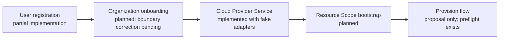

# PlatformOps implementation status

**Last reviewed:** 2026-09-23  
**Purpose:** Cross-change review dashboard. This is a navigation and
status note, not a source of behavioral requirements. Each OpenSpec
change remains authoritative for its proposal, requirements, design,
and task checkboxes.

## How to use this note

OpenSpec has four durable artifacts for each change:

| Artifact | Captures |
|---|---|
| `proposal.md` | Why the change exists and its boundary |
| `specs/*/spec.md` | Required externally observable behavior |
| `design.md` | The chosen technical approach and tradeoffs |
| `tasks.md` | Implementable work and its completion evidence |

Use the linked `tasks.md` files for the current, granular progress.
Update this document only when a cross-change milestone or the recommended
delivery order changes.

## Delivery view

The arrows show the intended dependency order. They do not mean that an
earlier workflow grants access to a later one: every stage remains
deny-by-default and must explicitly resolve its own trusted context.

## Change status

| Change | Planning state | Implementation state | Review / next step |
|---|---|---|---|
| [User registration](../openspec/changes/build-user-registration/) | Proposal, specs, design, and tasks complete | Tasks 1–3 complete: passwordless registration, PostgreSQL persistence, scanner-safe confirmation, and an active unassociated session | Complete post-login organization-domain discovery (tasks 4.1–4.3), then run final boundary verification (5.1–5.3) |
| [Organization onboarding](../openspec/changes/build-org-onboarding/) | Proposal, spec, design, and tasks complete; cloud/provider ownership corrected 2026-09-23 | Tasks 2.1–2.4 complete with in-memory lifecycle and deterministic fake verifier: pending request → proof + digest-bound approval → active organization and recorded initial tenant-admin | A production domain/IdP proof mechanism and durable persistence remain separate future slices. Cloud-provider work remains in the Cloud Provider Service |
| [Organization member onboarding](../openspec/changes/build-organization-member-onboarding/) | Proposal, spec, design, and tasks complete | Not implemented | Start PostgreSQL membership and invitation contracts, then deterministic gateway-routed `/join-org` workflow. Membership alone must not grant a Resource Scope or cloud access |
| [Cloud Provider Service](../openspec/changes/build-cloud-provider-service/) | Proposal, four capability specs, design, and tasks complete | Tasks 1–5 complete using deterministic fake adapters: connection verification/inquiry, read-only discovery, reviewed attachment, and separately authorized container bootstrap | Keep live provider adapters disabled. Add a live adapter only as a separate verified implementation slice with current official-provider validation |
| [Resource Scope bootstrap](../openspec/changes/build-resource-scope-bootstrap/) | Proposal, three capability specs, design, and tasks complete | No registry, authorization evaluator, or binding resolver code | Start task 1: typed Organization → BU → Team → PlatformOps Project → Environment records and an active-scope registry |
| [Provision flow](../openspec/changes/build-provision-flow/) | Proposal, spec, design, and tasks complete | Existing code has non-mutating provision preflight only | Integrate active membership and resolved Resource Scope context only after their separate changes are implemented |

## Confirmed vocabulary and security boundaries

| Term | Meaning |
|---|---|
| **Principal** | An authenticated user, identity group, or service principal that asks for an action |
| **PlatformOps Resource Scope** | The logical authorization context: `org:…:bu:…:team:…:project:…:env:…` |
| **PlatformOps Project** | A logical governance container, independent from a cloud-provider project, account, or subscription |
| **Cloud Resource Container** | An AWS account, GCP project, or Azure subscription |
| **Provider Binding** | A trusted mapping from a Resource Scope to a Cloud Resource Container and execution identity; never accepted from a client token/request |
| **Deployment Destination** | Runtime location inside a container, such as an EKS namespace or Cloud Run service; separate from the Resource Scope |

An authenticated login establishes a principal only. It does not establish
organization membership, Resource Scope access, a provider binding, or cloud
execution authority.

## Recommended next review sequence

1. Finish user-registration domain discovery against active, verified
   organization-domain records. It returns a journey only; it creates no
   membership or provider access.
2. Select a production domain/IdP proof mechanism and durable organization
   persistence as separate, reviewed onboarding follow-on work; do not add a
   provider connection to it.
3. Build organization-member onboarding: PostgreSQL membership/invitation
   records, then the deterministic `/join-org` workflow.
4. Begin Resource Scope bootstrap task 1, then its deterministic access and
   binding-resolution tasks.
5. Integrate membership and resolved Resource Scope context into the already
   planned provision workflow.

## Explicitly not built yet

- Personal-organization creation or business-organization claiming
- Organization memberships, invitations, SCIM, or tenant IdP configuration
- Live AWS, GCP, or Azure adapters or cloud mutations
- Resource Scope registry, grants, governance evaluator, or provider-binding resolver
- Provision approval, execution, evidence, or a frontend for these workflows
