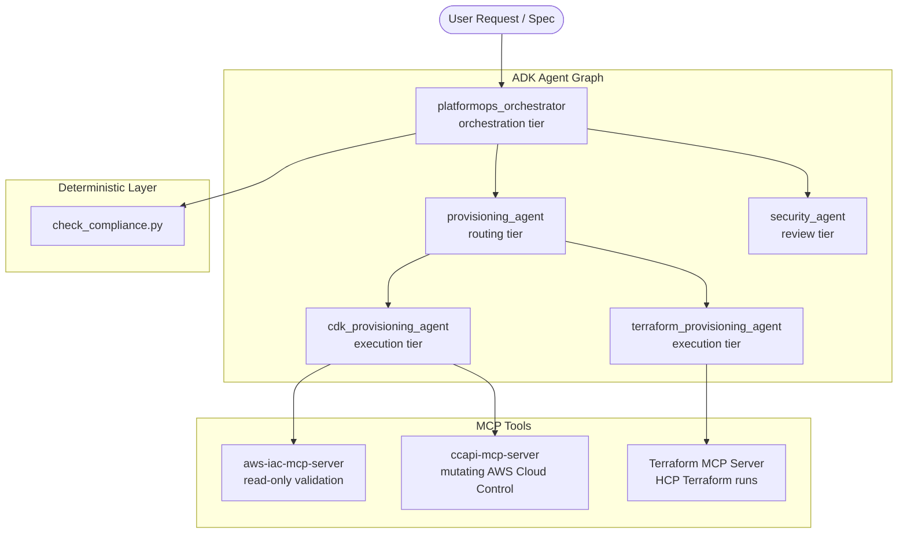

# Current PlatformOps Agentic Architecture

This document provides a deep dive into the **existing architecture** of the [PlatformOps](file:///opt/wecan/aiml_learning_gang_ws/vibecoding_ws/capstone_project/README.md) system. It explains how the multi-agent graph, deterministic validation engines, and Model Context Protocol (MCP) servers interact to securely provision infrastructure.

---

## 1. Core Multi-Agent Topology (ADK Graph)

Instead of a single large prompt trying to perform all tasks, PlatformOps divides responsibilities among five specialized agents in a hierarchical graph using the **Google Agent Development Kit (ADK)**:



### The Role-Based Splits:
1. **[platformops_orchestrator](file:///opt/wecan/aiml_learning_gang_ws/vibecoding_ws/capstone_project/agents/orchestrator.py#L8-L20) (Orchestration)**: Serves as the top-level entry point. It manages the overall state of the execution lifecycle, invokes compliance checks, gates operations behind the security review, and returns the final report to the user.
2. **[provisioning_agent](file:///opt/wecan/aiml_learning_gang_ws/vibecoding_ws/capstone_project/agents/provisioning_agent.py#L8-L21) (Routing)**: A lightweight router that reads the user's input to determine their preferred Infrastructure as Code (IaC) tool (CDK vs. Terraform) and delegates to the appropriate specialist.
3. **[cdk_provisioning_agent](file:///opt/wecan/aiml_learning_gang_ws/vibecoding_ws/capstone_project/agents/cdk_provisioning_agent.py#L9-L25) (CDK Specialist)**: Operates the AWS Cloud Control API path. It designs CloudFormation templates and runs linting/compliance validation tools.
4. **[terraform_provisioning_agent](file:///opt/wecan/aiml_learning_gang_ws/vibecoding_ws/capstone_project/agents/terraform_provisioning_agent.py#L9-L22) (Terraform Specialist)**: Operates the HCP Terraform path. It writes `.tf` configurations and communicates with HCP workspaces.
5. **[security_agent](file:///opt/wecan/aiml_learning_gang_ws/vibecoding_ws/capstone_project/agents/security_agent.py#L6-L18) (Security Reviewer)**: A non-executing auditor. It has **no tool access** and acts purely on reasoning to evaluate proposed plan changes against static policy definitions.

---

## 2. Separation of Concerns: Skills vs. MCP

The architecture separates *logic/procedure* from *action/reach* using two concepts:

* **Agent Skills (`skills/`)**: Encoded in markdown files (e.g., [provision-infra/SKILL.md](file:///opt/wecan/aiml_learning_gang_ws/vibecoding_ws/capstone_project/skills/provision-infra/SKILL.md) and [security-review-checklist/SKILL.md](file:///opt/wecan/aiml_learning_gang_ws/vibecoding_ws/capstone_project/skills/security-review-checklist/SKILL.md)), skills represent the deterministic step-by-step procedures that agents are instructed to follow.
* **MCP Servers (`mcp_server/`)**: Servers run as independent subprocesses providing standardized JSON-RPC endpoints. They supply the actual "reach" to talk to APIs (AWS and HashiCorp). The agents invoke these MCP tools to execute commands.

---

## 3. The Step-by-Step Request Lifecycle

When a user submits a request (e.g., *"Deploy a static web portal using CDK"*), the system progresses through the following steps:

```
[Inbound Request]
        │
        ▼
 1. COMPLIANCE PREFLIGHT ──► Runs spec/check_compliance.py (No LLM call)
        │
        ▼ (PASS)
 2. PLAN DRAFTING ─────────► provisioning_agent delegates to cdk_provisioning_agent
        │                    ├─ Synthesizes CloudFormation template
        │                    └─ Runs validation tools (cfn-lint, cfn-guard)
        │
        ▼ (Valid)
 3. VIBE DIFF GENERATION ──► cdk_provisioning_agent drafts plain-English change summary
        │                    and halts execution
        │
        ▼
 4. SECURITY REVIEW ───────► security_agent evaluates Vibe Diff + static policy files
        │                    ├─ Checks cost ceiling ($5 ceiling)
        │                    ├─ Checks region (us-east-1 only)
        │                    ├─ Checks allowed-resource-types.json
        │                    └─ Checks iam-policy.json
        │
        ▼ (APPROVED)
 5. EXECUTION & VERIFY ────► cdk_provisioning_agent executes ccapi create_resource,
                             calls get_resource to verify, and returns final URL
```

**Read this diagram as the *intended* flow per the agents' prompts and
skill instructions, not a code-enforced sequence.** Nothing today wires
these 5 steps together programmatically — there is no orchestration code
that runs step 1 before step 2, or that stops step 5 from happening
without step 4 having occurred. Section 4 below traces one concrete
request through what's actually real code versus what's currently just an
instruction the LLM is trusted to follow.

---

## 4. Worked Example: What Actually Happens for One Request

Input: Slack user `U456`, workspace `T123`, channel
`C-platform-payments`, message: *"Using CDK, deploy a static site called
demo-blog in us-east-1."* This traces the same request through real files
and real gaps — see `docs/harness_deep_dive.md` and
`docs/planned_implementation.md` for the design this is measured against.

| # | What should happen | Reality today |
|---|---|---|
| 1 | Look up the inbound channel/workspace/channel-id against `config/bindings.yaml` to resolve `org_id`/`bu_id`/`agent_id` | **Gap** — `ConfigLoader` loads and validates the binding list (real, tested), but no `resolve(channel, workspace_id, channel_id)` lookup function exists yet |
| 2 | Construct a `RequestEnvelope` from the message | **Gap** — the schema is real (`harness/schemas.py`), nothing constructs one from a real message yet |
| 3 | Load the `WorkspaceBundle` for that BU (region, allowed resource types, cost ceiling) | **Real** — `harness/config_engine.py` + `config/workspace_bundles/acme-payments.yaml`, tested |
| 4 | Run `spec/check_compliance.py` against a structured version of the request | **Gap** — it expects a YAML dict shaped like `spec/example_submission.yaml`; nothing translates natural-language text into that shape automatically, and nothing calls it automatically before provisioning starts |
| 5 | `plan_request(envelope)` starts an ADK Runner around `root_agent` | **Doesn't exist** — `agents/orchestrator.py` only defines `root_agent = Agent(...)`; there's no `Runner`/`Session` construction anywhere in this codebase, and no `if __name__ == "__main__":` block. Running `python -m agents.orchestrator` per `README.md`'s current instructions just constructs the Agent objects and exits — it processes no input at all. (ADK's actual convention is almost certainly `adk web agents/` or `adk run agents/`, which auto-discovers `root_agent`; the README instruction needs fixing, tracked in `NEXT_STEPS.md`.) |
| 6 | `platformops_orchestrator` → `provisioning_agent` reads "Using CDK" → delegates to `cdk_provisioning_agent` | **Real, live ADK graph** — functional today if a Runner were actually invoking it |
| 7 | `cdk_provisioning_agent` calls `aws-iac-mcp-server`'s validation tools to draft a template | **Real** — read-only MCP calls, functional once `uvx`/AWS creds are set up per `README.md` |
| 8 | Produce a `ToolIntent` via a non-executing `propose_tool_intent(...)` tool instead of calling a real mutating tool | **Doesn't exist — and this is a live gap, not just a missing feature**: `agents/cdk_provisioning_agent.py` has `ccapi-mcp-server`'s *mutating* tools (`create_resource`/`update_resource`/`delete_resource`) attached **directly** to the agent today. As currently wired, if a Runner were invoking this graph against a real AWS account, the agent could call a real mutation itself — the "wait for approval" rule is a prompt instruction only, with no code stopping it. |
| 9 | `security_agent` reviews the Vibe Diff and approves | **Real** LLM reasoning step, but its decision isn't connected to any table or gate — it's text the orchestrator relays, not a recorded, checkable fact |
| 10 | Record the approval: `dispatcher.record_approval(plan_id, plan_hash, agent_approved=True)` | **Real, tested in isolation** — `tests/test_harness.py` proves this call works, but with fabricated test data, not a real plan from step 9 |
| 11 | Gate execution: `dispatcher.evaluate_intent(intent)` — checks bundle exists, resource type allow-listed, region matches, approval hash matches and isn't tampered | **Real, tested, deny-by-default** — but nothing calls this before a mutating tool runs, per #8 |
| 12 | Only on `True`, call the real `ccapi-mcp-server` `create_resource` | **Doesn't exist as a separate, gated step** — see #8 |
| 13 | Write the result to `audit_logs`, relay it back to the originating Slack channel | **Partially real** — the SQLite write is tested in isolation; there is no channel adapter to relay anything back to Slack at all |

**The one-sentence version**: the harness (`harness/`) is fully tested in
isolation but not invoked by anything real yet, and the live agent graph
(`agents/`) currently has no runtime enforcement between "the agent
decides to mutate AWS" and "it happens" — only a prompt telling it to
wait. Closing this is exactly `docs/planned_implementation.md`'s Phase 3
(the one required item in the current spike), not a new design.

---

## 5. Defense-in-Depth Guardrail Layering

Security is enforced at multiple layers to prevent a single point of failure (such as an LLM reasoning error or prompt injection) from deploying unauthorized resources:

```
[Agent Intent]
     │
     ▼
┌─────────────────────────────────────────────────────────────┐
│ 1. Compliance Script Guardrail                              │
│    (Deterministic spec check: region, cost, naming prefix)   │
└────────────────────────────┬────────────────────────────────┘
                             │ (Pass)
                             ▼
┌─────────────────────────────────────────────────────────────┐
│ 2. Security Agent Check                                     │
│    (LLM validation of Vibe Diff plan text against checklists)│
└────────────────────────────┬────────────────────────────────┘
                             │ (Pass)
                             ▼
┌─────────────────────────────────────────────────────────────┐
│ 3. Application Allow-List                                   │
│    (Allowed CloudFormation resource types list)             │
└────────────────────────────┬────────────────────────────────┘
                             │ (Pass)
                             ▼
┌─────────────────────────────────────────────────────────────┐
│ 4. Cloud IAM Policy                                         │
│    (AWS IAM policy bounds credentials used by MCP process)  │
└────────────────────────────┬────────────────────────────────┘
                             │ (Allowed by AWS)
                             ▼
                     [Deployed Cloud]
```

### The Layer Safeguards:
1. **Deterministic Prefilter**: [check_compliance](file:///opt/wecan/aiml_learning_gang_ws/vibecoding_ws/capstone_project/spec/check_compliance.py#L15-L38) blocks S3 public-write and forces CloudFront HTTP-to-HTTPS redirect rule validation before agents plan the build.
2. **Double Allow-Lists for CDK/CCAPI**: 
   * [iam-policy.json](file:///opt/wecan/aiml_learning_gang_ws/vibecoding_ws/capstone_project/infra/iam-policy.json) restricts AWS account actions (IAM tier).
   * [allowed-resource-types.json](file:///opt/wecan/aiml_learning_gang_ws/vibecoding_ws/capstone_project/infra/allowed-resource-types.json) restricts target CloudFormation types (App tier). This blocks the agent from requesting resources like `AWS::EC2::Instance` even if IAM allows Cloud Control API actions.
3. **Operator Control Switch for Terraform**: On the Terraform path, the system requires the environment variable `ENABLE_TF_OPERATIONS=true` to be set by the human operator. The agent cannot toggle this flag itself, serving as an operational kill-switch.

### Which of these are actually code-enforced today (correction)
The diagram above is best read as the intended defense-in-depth model,
not a guarantee about the current build — see Section 4's worked example
for the specific gaps. As of now:
- **Layer 4 (Cloud IAM Policy)** is the only layer enforced independently
  of this codebase's own logic — it's AWS itself refusing an action
  outside `infra/iam-policy.json`, regardless of what our code does or
  doesn't do.
- **Layer 1 (Compliance Script)** is real, deterministic code
  (`spec/check_compliance.py`), but nothing calls it automatically before
  provisioning starts — it has to be run by hand today.
- **Layer 2 (Security Agent Check)** is a real LLM reasoning step, but
  it's a prompt instruction, not a code-level gate — there's no
  mechanism stopping `cdk_provisioning_agent` from calling a mutating
  tool without waiting for it.
- **Layer 3 (Application Allow-List)** — `infra/allowed-resource-types.json`
  is real data, and `harness/tool_dispatcher.py`'s `BrokeredToolDispatcher`
  really does check it — but that dispatcher isn't wired into the live
  agent graph yet (see `harness_deep_dive.md`), so this check currently
  runs only in `tests/test_harness.py`, not on a real request.

So today, layer 4 is the only one AWS itself would actually stop you at;
layers 1-3 are real code or real reasoning, but none of them are
mechanically wired between "the agent decides to act" and "the action
happens." Closing that gap is `docs/planned_implementation.md` Phase 3.
