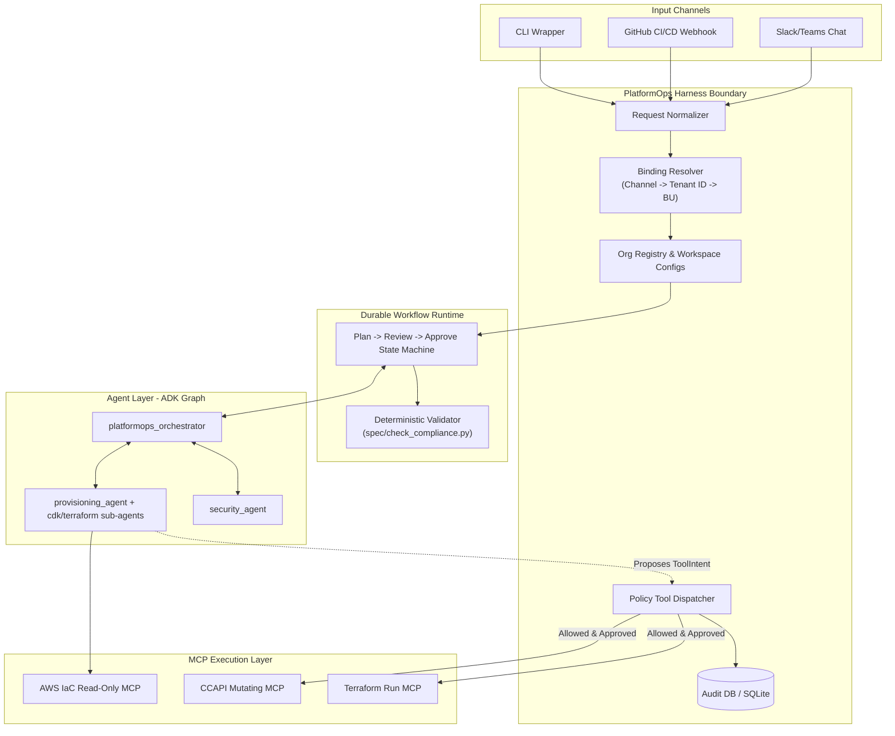

# Architectural Analysis: PlatformOps Harness

This document provides a comprehensive, production-oriented deep dive into the **Harness Architecture** for the [PlatformOps](file:///opt/wecan/aiml_learning_gang_ws/vibecoding_ws/capstone_project/README.md) agentic system. It maps the current state to the future-state production gateway, outlines strict security-by-construction patterns, models data schemas, drafts implementation spikes, and analyzes orchestration alternatives.

---

## 1. System Topology & Current MVP vs. Production Harness

The core problem in PlatformOps is bridging **probabilistic agentic judgment** (designing templates, identifying cost/risk patterns) with **deterministic infrastructure safety** (ensuring no unauthorized resources are deployed, auditing every change, bounding blast radius).

### Current MVP Topology (Hackathon Scope)
Today, the project operates as a flat, single-session command line script:
* **Orchestration**: A hierarchical ADK graph starting at [root_agent](file:///opt/wecan/aiml_learning_gang_ws/vibecoding_ws/capstone_project/agents/orchestrator.py#L8-L20), routing to [provisioning_agent](file:///opt/wecan/aiml_learning_gang_ws/vibecoding_ws/capstone_project/agents/provisioning_agent.py#L8-L21) which delegates to [cdk_provisioning_agent](file:///opt/wecan/aiml_learning_gang_ws/vibecoding_ws/capstone_project/agents/cdk_provisioning_agent.py#L9-L25) or [terraform_provisioning_agent](file:///opt/wecan/aiml_learning_gang_ws/vibecoding_ws/capstone_project/agents/terraform_provisioning_agent.py#L9-L22).
* **Compliance Checks**: Deterministic linting and rules executed via [check_compliance](file:///opt/wecan/aiml_learning_gang_ws/vibecoding_ws/capstone_project/spec/check_compliance.py#L15-L38) against the rules in [reference_architecture.md](file:///opt/wecan/aiml_learning_gang_ws/vibecoding_ws/capstone_project/spec/reference_architecture.md).
* **Review Gate**: The [security_agent](file:///opt/wecan/aiml_learning_gang_ws/vibecoding_ws/capstone_project/agents/security_agent.py#L6-L18) evaluates the plan text using the [security-review-checklist/SKILL.md](file:///opt/wecan/aiml_learning_gang_ws/vibecoding_ws/capstone_project/skills/security-review-checklist/SKILL.md) procedure.
* **Tool Reach**: MCP servers ([AWS_IAC_MCP_SERVER](file:///opt/wecan/aiml_learning_gang_ws/vibecoding_ws/capstone_project/mcp_server/external_servers.py#L25-L29), [CCAPI_MCP_SERVER](file:///opt/wecan/aiml_learning_gang_ws/vibecoding_ws/capstone_project/mcp_server/external_servers.py#L34-L38), [TERRAFORM_MCP_SERVER](file:///opt/wecan/aiml_learning_gang_ws/vibecoding_ws/capstone_project/mcp_server/external_servers.py#L44-L52)) are attached directly to execution agents. The agent has the actual capability to execute cloud mutations without runtime gateway interception.

### Production Harness Topology
A production-grade cloud execution system requires a **Gateway boundary** that decouples user communication from tool execution. The agent is treated as a **Planner/Reviewer**, whereas the Harness acts as the **Enforcer/Operator**.



---

## 2. OpenClaw Mapping & Multi-Tenancy

[OpenClaw](https://docs.openclaw.ai/) provides a strong conceptual reference for building multi-interface agent gateways. However, cloud infrastructure automation requires stricter safety guarantees than coding assistants.

### Mapping to OpenClaw Primitives
1. **The Gateway**: OpenClaw runs a single process that serves as the entrypoint. In PlatformOps, the Gateway holds the state of all active provisioning plans, active executions, and approval status.
2. **Deterministic Bindings**: OpenClaw maps incoming channel identities (e.g., Slack member IDs, group chats) to a specific `agentId`.
   * In PlatformOps, we map incoming requests to a specific **Business Unit (BU)** and **Workspace Bundle** configuration.
   * Wildcard matching rules must fail closed: if a channel does not map to a registered BU, the request is immediately rejected.
3. **Flat `agentId` Isolation**: In OpenClaw, the isolation boundary is a flat string identifier mapped to a filesystem directory (`~/.openclaw/workspace-<agentId>`). PlatformOps adopts this flat isolation but encapsulates it under a hierarchical **Tenant Organization -> Business Unit** config registry.

### Multi-Tenant Isolation Model
PlatformOps enforces three levels of tenant isolation to prevent credential cross-contamination or state leakage:

| Isolation Level | Scope | Mechanism | Danger Addressed |
| :--- | :--- | :--- | :--- |
| **Business Unit (BU)** | Internal division (e.g., `acme-payments`) | Separate `agentId`, separate local session directories, distinct cloud AWS profiles. | Cross-BU resource pollution or credential sharing. |
| **Tenant Org** | Separate customer boundary (e.g., `acme` vs. `cyberdyne`) | Separate DB prefixes, isolated runtime instances or network namespaces (e.g., Kubernetes namespaces). | Hostile tenant hijacking or cross-customer state snooping. |
| **Execution Host** | High-risk/Regulated tenants | Distinct virtual machines/containers, dedicated IAM instance profiles, separate secret store volumes. | Shared container escapes or host-level IAM credential exfiltration. |

> [!CRITICAL]
> Reusing the same `agentId` or directory across separate BUs will result in session and credential collisions. Onboarding automation must always generate a cryptographically secure, unique UUID or structured slug (e.g., `org-bu-uuid`) for the local workspace.

---

## 3. The Brokered Tool Dispatcher Pattern

The core security vulnerability in standard LLM agent frameworks is **excessive tool access**. If the provisioning agent has direct execution access to [CCAPI_MCP_SERVER](file:///opt/wecan/aiml_learning_gang_ws/vibecoding_ws/capstone_project/mcp_server/external_servers.py#L34-L38) tools, any prompt injection or plan deviation can cause immediate, unauthorized resource changes in AWS.

To resolve this, PlatformOps implements the **Brokered Tool Dispatcher Pattern**:

```
[Agent Core] 
     │ 
     │ 1. Request mutating tool (e.g., create_resource)
     ▼
[Harness Tool Wrapper]
     │ 
     │ 2. Intercept call and construct ToolIntent
     ▼
[Policy Dispatcher] ◄─── Reads ─── [Workspace Policy & Approval DB]
     │
     │ 3. Validate Plan Hash, Region, Cost, Resource Type & Approval State
     ├─── (Validation Fails) ──► Write Deny Audit ──► Exception returned to Agent
     │
     ▼ (Validation Passes)
[Local Stdio MCP Client] ──► CCAPI / Terraform Exec ──► Write Allow Audit ──► Cloud
```

### The `ToolIntent` Schema
Every mutating tool execution request is normalized into a structured schema containing the target workspace bundle, the planned change hash, the cost/region parameters, and the exact API payload:

```json
{
  "intent_id": "intent_7f8a9b2c",
  "plan_id": "plan_3f4e5d6c",
  "plan_hash": "sha256_e3b0c44298fc1c149afbf4c8996fb92427ae41e4649b934ca495991b7852b855",
  "org_id": "acme",
  "bu_id": "payments",
  "resource_type": "AWS::S3::Bucket",
  "resource_identifier": "platformops-demo-payment-receipts",
  "operation": "CreateResource",
  "region": "us-east-1",
  "estimated_monthly_cost": 0.50,
  "payload": {
    "BucketName": "platformops-demo-payment-receipts",
    "PublicAccessBlockConfiguration": {
      "BlockPublicAcls": true,
      "BlockPublicPolicy": true,
      "IgnorePublicAcls": true,
      "RestrictPublicBuckets": true
    }
  }
}
```

### Policy Validation Logic
The Dispatcher matches the incoming `ToolIntent` against active approvals:
1. **Plan Hash Match**: The `plan_hash` must match the SHA256 of the plan text approved by [security_agent](file:///opt/wecan/aiml_learning_gang_ws/vibecoding_ws/capstone_project/agents/security_agent.py#L6-L18) and, if required, signed off by a human in the Control UI.
2. **Resource-Type Constraints**: The requested `resource_type` must be present in the target business unit's [allowed-resource-types.json](file:///opt/wecan/aiml_learning_gang_ws/vibecoding_ws/capstone_project/infra/allowed-resource-types.json) list.
3. **Region Constraint**: The `region` parameter must match the `AWS_REGION` declared in the [WorkspaceBundle](file:///opt/wecan/aiml_learning_gang_ws/vibecoding_ws/capstone_project/.env.example) configuration.
4. **Cost Ceiling Check**: The cumulative cost of all planned resource additions must not breach the configured threshold.

---

## 4. Harness Data Schemas

To turn prompt-level policies into robust, auditable records, the Gateway
defines and persists five core schemas — `RequestEnvelope`,
`WorkspaceBundle`, `PlanRecord`, `ApprovalRecord`, and `ToolIntent` — as
Pydantic models.

**These are real, tested code now, not just a draft** — see
`harness/schemas.py`. An earlier version of this section had the drafted
code inline; it's been extracted so there's one copy to keep correct
instead of two that can drift.

`ToolIntent` (see section 3 below for the JSON shape) is defined there too,
alongside the other four — the original draft here only sketched it as a
JSON example.

---

## 5. First Implementation Spike — status

This spike is no longer just a draft: `harness/config_engine.py`
(`ConfigLoader`) and `harness/tool_dispatcher.py`
(`BrokeredToolDispatcher`) are real, working code, proven by
`tests/test_harness.py` (8 passing tests covering config validation,
allow/deny paths, tampered-hash detection, and audit logging).

Two corrections made while turning the draft into working code, worth
knowing if you're reading old notes or a cached copy of this doc:
- `evaluate_intent` had a `selfself` typo in the original draft — fixed.
- The original uniqueness rule ("no agent_id bound more than once") was
  too strict — it would reject one BU legitimately reachable via two
  channels (Slack *and* a webhook). The real rule, now enforced in
  `harness/config_engine.py`, is "no *two different* BUs share one
  `agent_id`."

Also added: `BrokeredToolDispatcher.record_approval()` — the original
draft only had the read path (`evaluate_intent` checking the `approvals`
table) with no way to actually insert an approval row, which meant nothing
could ever pass in a real test.

**Not yet done**: wiring this dispatcher to actually intercept
`cdk_provisioning_agent`/`terraform_provisioning_agent`'s real MCP tool
calls — it's tested standalone, not yet in the live agent graph. See
`docs/HARNESS_DESIGN.md`'s "PlatformOps runtime boundary to build next"
for the current status line by line.

---

## 6. Alternative Harness Framework Analysis

When building the state machine that guides a request from **Ingress -> Planning -> Compliance -> Approval -> Brokered Dispatch**, utilizing an open-source workflow runtime avoids reinventing the wheel on state management.

| Engine | Ideal Scenario / Best Use Cases | Pros for PlatformOps | Cons / Gaps for PlatformOps |
| :--- | :--- | :--- | :--- |
| **Temporal** | Highly reliable, long-running, multi-step transaction lifecycles (e.g., waiting days for manual review, retrying failed CloudFormation deployments, orchestrating rollback workflows). | • Durable execution out of the box.<br/>• Guarantees exactly-once execution.<br/>• Built-in timer support (e.g., auto-expire approvals after 2 hours). | • High operational complexity (requires hosting Temporal clusters).<br/>• Steep learning curve.<br/>• Python SDK is verbose. |
| **LangGraph** | Complex agentic reasoning loops where the next step is dynamically determined by model evaluations. | • First-class support for LLM conversations.<br/>• Stateful persistence with easy "interrupt" checkpoints (for human-in-the-loop gates). | • Lacks native cluster durability for enterprise scale.<br/>• Heavy dependency on LangChain libraries.<br/>• Harder to audit non-agentic pipelines. |
| **CrewAI** | Role-based task delegation with pre-defined structures and sequence boundaries. | • Simplifies wiring multiple expert agents.<br/>• Built-in tasks and memory contexts. | • Harder to enforce strict, deterministic execution rules.<br/>• Agent-to-agent chatter consumes tokens and increases response latency. |

### Architectural Recommendation: Layered Temporal + ADK Topology
To achieve maximum production reliability:
1. Use **Temporal** to define the outer durable pipeline: `inbound request -> trigger ADK agent planning -> block execution for approval token -> execute dispatch -> verify status`.
2. Keep the **Google ADK** agent graph encapsulated inside a single, stateless Temporal Activity. The agents do the heavy lifting of drafting proposals, but state, timeouts, and human intervention are managed in Temporal's event history database.
3. Keep the **Policy Tool Dispatcher** as a local decorator wrapper around all mutating MCP tool calls, validating each mutation call directly against the active database state.
