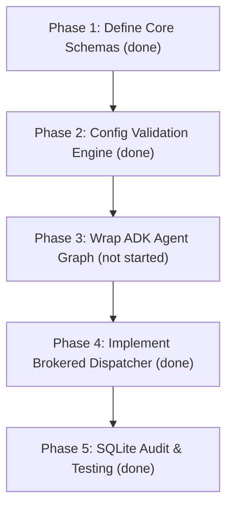

# Planned Implementation Walkthrough: PlatformOps Gateway

This document walks through the step-by-step implementation plan for the **PlatformOps Harness Gateway**. As detailed in [NEXT_STEPS.md](file:///opt/wecan/aiml_learning_gang_ws/vibecoding_ws/capstone_project/NEXT_STEPS.md) and [HARNESS_DESIGN.md](file:///opt/wecan/aiml_learning_gang_ws/vibecoding_ws/capstone_project/docs/HARNESS_DESIGN.md), the first development spike shifts the system from a prompt-gated command-line script to a runtime-enforced security gateway.

The implementation is structured into **5 sequential phases**:

**Status**: Phases 1, 2, 4, and 5 are done — real code in `harness/`,
proven by the 8 passing tests in `tests/test_harness.py`. Phase 3 (wrap
the ADK graph behind `plan_request(envelope)`) is the one phase not
started; it's the actual next step, not this document's phases 1-2-4-5,
which are already built.

---



---

## Phase 1: Define Core Schemas & Envelopes — DONE (`harness/schemas.py`)

The first step is creating the data structures that hold state as requests transition from arrival to cloud deployment. These will be implemented using Pydantic models.

1. **`RequestEnvelope`**: Captures user metadata (Slack user, git commit, CLI args), routing metadata, and the raw YAML architecture specification.
2. **`WorkspaceBundle`**: Defines the environmental limits of the target workspace—the allowed region, account credentials key, cost threshold, and allowed resource types.
3. **`PlanRecord`**: Persists the proposed infrastructure change, its estimated cost, a unique cryptographic hash of the proposal, and the user-facing "Vibe Diff" summary text.
4. **`ApprovalRecord`**: Records the security approvals (both the autonomous agent check results and human reviewer signatures).
5. **`ToolIntent`**: Captures a single planned mutating cloud operation (e.g., creating an S3 bucket with specific properties) before it is sent to the cloud.

---

## Phase 2: Configuration & Binding Validation Engine — DONE (`harness/config_engine.py`)

We need a deterministic config engine to load and validate bindings and workspace profiles before any execution starts. This implements the **fail-closed** security behavior described in [HARNESS_DESIGN.md](file:///opt/wecan/aiml_learning_gang_ws/vibecoding_ws/capstone_project/docs/HARNESS_DESIGN.md#L351-L352).

```
Config Folder 
  ├── bindings.yaml  (Defines Channel -> Org -> BU -> agent_id mappings)
  └── workspace_bundles/
        ├── payments-dev.yaml
        └── billing-prod.yaml
```

The validation logic will:
* **Validate syntax**: Load config files and instantiate Pydantic schemas. If a file is malformed, the gateway raises an exception and halts initialization.
* **Enforce referential integrity**: Confirm every channel binding points to a valid, existing `WorkspaceBundle`.
* **Ensure flat uniqueness**: Enforce that no two business units or channels can map to the same target `agentId` (preventing session-leakage bugs).

---

## Phase 3: Wrap the ADK Agent Graph (`plan_request`) — NOT STARTED

Currently, [root_agent](file:///opt/wecan/aiml_learning_gang_ws/vibecoding_ws/capstone_project/agents/orchestrator.py#L8-L20) runs as a standalone process and directly triggers cloud mutations. We will wrap the existing ADK agents inside a modular function `plan_request(envelope: RequestEnvelope)`.

* **Role Change**: The agent graph no longer decides when to execute mutating tools. Instead, its role is restricted to **designing and reviewing**:
  1. The agent parses the envelope payload.
  2. The agent runs deterministic compliance checks (via [check_compliance](file:///opt/wecan/aiml_learning_gang_ws/vibecoding_ws/capstone_project/spec/check_compliance.py#L15-L38)).
  3. The agent interacts with read-only MCP resources (like [AWS_IAC_MCP_SERVER](file:///opt/wecan/aiml_learning_gang_ws/vibecoding_ws/capstone_project/mcp_server/external_servers.py#L25-L29)) to draft a plan.
  4. The agent writes a user-friendly plan explanation (Vibe Diff) and returns a proposed `PlanRecord`.

---

## Phase 4: Build the Brokered Tool Dispatcher — DONE (`harness/tool_dispatcher.py`)

This is the key security enforcement step. We will intercept mutating tools (e.g., CCAPI `create_resource` or Terraform `apply_run`) and route them through the Gateway's dispatcher.

```
Mutating Tool Call (from Agent) 
       │
       ▼
   Intercept ──► Generate ToolIntent 
                       │
                       ▼
             Run Dispatcher Checks:
             1. Does the ToolIntent match a valid ApprovalRecord?
             2. Is the resource type in allowed-resource-types.json?
             3. Does the cost remain below the ceiling?
             4. Does the region match WorkspaceBundle?
                       │
           ┌───────────┴───────────┐
      [Passes]                  [Fails]
           │                       │
           ▼                       ▼
Execute Cloud Mutation       Raise SecurityException
```

The agent is never given direct credentials to execute mutations. The dispatcher verifies the `ToolIntent` against the database's `ApprovalRecord` and executes the call on behalf of the agent only when verified.

---

## Phase 5: SQLite Audit Logger & Local Testing — DONE (`tests/test_harness.py`)

The final piece of the spike is establishing an immutable audit history and verifying the safety mechanisms:

1. **SQLite Database**: A lightweight database tracking:
   * `audit_logs`: A timeline of request, plan validation, approval decisions, tool executions, and security denials.
   * `approvals`: State table mapping approved `plan_hash` records.
2. **Deterministic Compliance Verification**: Verify that the gateway correctly rejects a non-compliant deployment (e.g., an S3 bucket configured with `public_write: true`) without calling external API tools.
3. **Dispatcher Gating Verification**: Test that a simulated prompt-injection attack or unauthorized resource addition in the planning phase is intercepted and blocked by the dispatcher policy.
