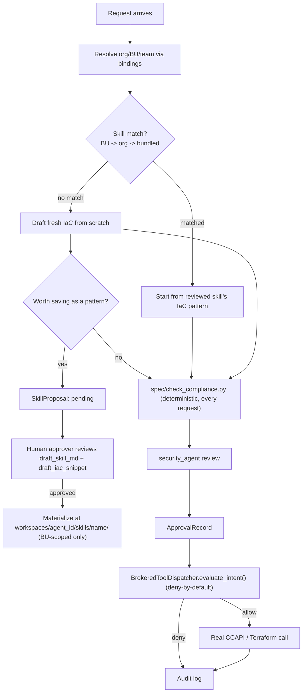

# Skill Submission vs. Spec Submission — Disambiguation, and an Org→BU→Team Recap

## Status
Synthesis, not a new design — nothing new is built here. This exists
because "submission" is used for two different pipelines elsewhere in
these docs, and that overload is easy to conflate: **submitting an infra
spec** (checked deterministically) and **submitting a skill** (checked by
a human reviewer). They intersect but are not the same gate, the same
artifact, or the same approver. This doc also recaps Org→BU→Team in one
table for quick reference — see `docs/ui_and_multitenancy_deep_dive.md`
for the full reasoning, which this doesn't repeat.

## Org → BU → Team, recapped in one table
Full reasoning lives in `docs/ui_and_multitenancy_deep_dive.md` and
`docs/HARNESS_DESIGN.md`'s "Multi-tenancy" section — this is the
short version for orientation.

| Layer | Isolation unit? | Where it lives today | Status |
|---|---|---|---|
| **Org** | No — config-layer grouping only | Would be `orgs.yaml` | Designed only, not built |
| **Business Unit** | **Yes** — 1:1 with `agent_id`; owns workspace, credentials, cost ceiling, allowed resource types | `config/bindings.yaml` + `config/workspace_bundles/*.yaml` | Partially built — bundle schema/loader real (`harness/schemas.py`, `harness/config_engine.py`); no org-level registry grouping BUs yet |
| **Team member** | No — shares the BU's one workspace; distinguished only per-request | `RequestEnvelope.channel_user_id` (`harness/schemas.py:19`) | Field exists; not yet in the audit log (`harness/tool_dispatcher.py`'s `audit_logs` table has no `channel_user_id` column) |

The one rule worth over-stating: a "team" never gets its own workspace,
credentials, or skill tier. It's people sharing one BU's stuff, told apart
only by who sent the request.

## Two pipelines, both called "submission"

| | **Spec submission** | **Skill submission** |
|---|---|---|
| What's submitted | A structured infra spec (YAML) — `spec/example_submission.yaml` shape | A `SkillProposal` — a candidate reusable `SKILL.md` + IaC snippet |
| Submitted by | The requester's plan, always, every request | An agent, only when no existing skill matched the request |
| Checked by | Deterministic rules — `spec/check_compliance.py` against `spec/reference_architecture.md` | A human `TeamMember` with `role="approver"`/`"admin"` — no deterministic check possible, it's judging reusability/over-fitting |
| Approval artifact | Pass/fail + reason, feeds `security_agent`'s review | `SkillProposal.status: pending→approved/rejected` |
| Frequency | Every single request | Only on the "nothing matched" branch — rare, and shrinks as the skill library grows |
| Scope of outcome | This one request's plan | A reusable pattern, scoped to the originating BU only, never auto-promoted |
| Code today | Real — `spec/check_compliance.py` runs, just not yet wired as a mandatory preflight | Design only — `SkillProposal` schema is a sketch, nothing implemented |

They're not alternatives — a single request always goes through spec
submission (every plan gets compliance-checked); it *additionally* goes
through skill submission only on the branch where no skill matched and
the resulting draft is chosen to be preserved. See
`docs/skills_and_workspace_design.md` Part C for the full `SkillProposal`
lifecycle and why it needs its own approval gate distinct from approving
the infra change itself.

## Where the two pipelines meet, in one flow

Two things worth calling out explicitly since they're easy to miss reading
the prose version in `docs/end_to_end_flow_example.md`:

1. **Spec submission is unconditional; skill submission is optional and
   conditional.** Every plan hits `spec/check_compliance.py`. Only a
   fresh, unmatched draft can *become* a `SkillProposal`, and only if
   someone chooses to propose it — reusing an existing skill never
   re-triggers skill submission.
2. **The two approvals are independent records, not one approval wearing
   two hats.** Approving *this* infra change (`ApprovalRecord` against the
   `PlanRecord`/`ToolIntent`) and approving *persisting the pattern*
   (`SkillProposal.status`) can diverge — e.g. "execute this now, don't
   save it as a template yet." Already noted in
   `docs/end_to_end_flow_example.md` step 7; restated here because it's
   the detail that makes "submission" ambiguous if you don't separate the
   two artifacts.

## What's real vs. design, restated for this specific confusion
| Piece | Status |
|---|---|
| Org/BU/team resolution (bindings → workspace bundle) | Partially built — see table above |
| Spec submission (`spec/check_compliance.py`) | Real code; not yet a mandatory automatic preflight |
| Skill lookup/precedence (BU→org→bundled) | Design only |
| Skill submission (`SkillProposal` lifecycle) | Design only |
| Dispatcher gate (`BrokeredToolDispatcher`) | Real, tested standalone; not yet wired to live agent tool calls |

## How this relates to the existing docs
- Recaps, doesn't replace, `docs/ui_and_multitenancy_deep_dive.md`'s
  Org→BU→team-member reasoning.
- Names and separates two things `docs/skills_and_workspace_design.md`
  Part C and `docs/end_to_end_flow_example.md` already describe but never
  contrast directly against each other as "two submission pipelines."
- Doesn't change the one required next step
  (`plan_request(envelope)`, `docs/planned_implementation.md` Phase 3) —
  both pipelines above are either already-real code paths that need
  wiring, or design layered on top of that step, not a prerequisite for it.
