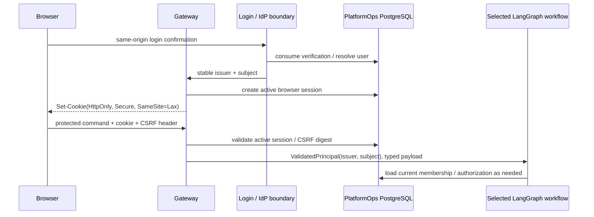

# Design

## Context

`build-user-registration` creates a stable PlatformOps user after scanner-safe
email confirmation, but its internal `ActorSession` is not a browser transport
or authorization contract. `build-control-plane-command-router` already
requires a gateway-derived `ValidatedPrincipal` for protected commands. This
change supplies the narrow boundary between those two contracts.

## Goals / Non-Goals

**Goals:**

- Make browser-only chat frictionless after passwordless confirmation: the
  browser automatically sends a protected cookie on same-origin requests.
- Keep the bearer credential unavailable to JavaScript and out of URLs,
  browser storage, graph state, logs, and chat content.
- Ensure every protected workflow receives only a validated immutable principal
  and resolves current authorization from PostgreSQL.
- Allow the same session boundary to be used after a future verified corporate
  OIDC/SAML login.

**Non-Goals:**

- This change does not define user registration, organization onboarding,
  organization membership, Resource Scope authorization, provider binding, or
  cloud credential storage.
- It does not implement Authentik, another IdP, a frontend, token refresh,
  long-lived "remember me" sessions, or a generic policy engine.

## Decisions

### Gateway owns session transport; workflows own business orchestration

The passwordless confirmation handler calls a gateway session issuer after it
has atomically created or recovered the user. The issuer records a server-side
session and returns cookie metadata to the HTTP response boundary. A workflow
never sees a raw token or cookie. For a protected request, the gateway validates
the cookie and constructs `ValidatedPrincipal(issuer, subject)` before calling
the command router. The router and each target workflow independently load
current membership, grants, and bindings from PostgreSQL when needed.

This preserves the existing boundary: login identifies a principal; it does not
authorize a target or cloud action.

### Token shape is intentionally minimal

The signed token has exactly these claims:

| Claim | Meaning |
|---|---|
| `iss` | PlatformOps session issuer |
| `sub` | Stable PlatformOps user subject |
| `sid` | Opaque server-side session identifier |
| `aud` | PlatformOps browser gateway audience |
| `iat` | Issued-at time |
| `exp` | Short, server-configured expiry |

The token has no email, membership, role, scope, provider, or cloud-credential
claim. Authorization is not cached in a JWT because it must reflect revocation,
membership changes, and binding changes immediately at the control-plane
boundary.

### Cookie and request protections are fixed for v1

The gateway uses a host-scoped session cookie named by application
configuration, with `HttpOnly`, `Secure`, `SameSite=Lax`, `Path=/`, a bounded
`Max-Age`, and no permissive cross-domain scope. It emits the token only by
`Set-Cookie`; it never exposes it to JavaScript.

For state-changing requests, the browser client obtains an independently random
CSRF value associated with the server-side session and presents it in a custom
request header. The gateway rejects missing/mismatched proof and rejects an
unexpected `Origin` before routing. Same-origin protected GET behavior can be
defined later; it must never perform a mutation.

`SameSite=Lax` is defense in depth, not the CSRF control. The explicit Origin
and CSRF checks are mandatory for cookie-authenticated mutations.

### PostgreSQL persists session lifecycle; a secret manager provides signing keys

The PlatformOps PostgreSQL schema receives a `browser_sessions` record with:

- generated session ID, user issuer/subject reference, creation and expiry
  timestamps;
- revocation/logout timestamp and reason; and
- a protected digest of the CSRF secret, never its plaintext value.

The database is authoritative for whether a token's `sid` remains active. The
gateway reads a signing-key provider from deployment configuration backed by a
secret-management system. Signing keys are not stored in PostgreSQL, JWTs,
workflow state, or source control. The provider must support a current key ID
and a bounded verification set during key rotation. Local development uses an
explicit non-production secret supplied outside tracked files.

### Failure behavior is deny-by-default

Any malformed cookie, bad signature, wrong issuer/audience, expired token,
unknown session, user/session mismatch, revoked session, invalid Origin, or
invalid CSRF proof stops at the gateway with a generic unauthenticated or
forbidden result. It does not invoke a LangGraph workflow and does not reveal
whether a user, organization, or protected command exists.

### Future IdP integration is an input to, not an owner of, this boundary

Authentik or another organization IdP may later authenticate the person and
return a verified external identity. The IdP callback first maps it to a stable
PlatformOps user under its dedicated identity-linking rules, then calls this
same browser-session issuer. Authentik does not store PlatformOps memberships,
authorization decisions, provider bindings, or cloud-provider credentials.

## Data flow

## Migration Plan

1. Add typed session, signer, repository, cookie, and CSRF contracts with
   in-memory fakes for focused tests.
2. Add PostgreSQL session migration and transactional repository operations for
   create, validate, revoke, and CSRF verification.
3. Adapt successful passwordless confirmation to issue the browser cookie,
   without changing registration token semantics.
4. Add gateway extraction for protected command routes and same-origin/CSRF
   checks before command dispatch.
5. Add logout and expiry/revocation coverage. Keep the former internal session
   representation only as an internal compatibility detail until all callers
   use the gateway boundary.

## Risks / Trade-offs

- [Risk] XSS can still act as the logged-in user despite `HttpOnly` → Mitigation:
  CSP and frontend hardening are future work; cookie protection prevents token
  exfiltration but is not a complete XSS defense.
- [Risk] A JWT remains valid after membership changes → Mitigation: JWT conveys
  identity/session only; each action re-evaluates authorization from PostgreSQL.
- [Risk] Cookie-based auth enables CSRF if treated casually → Mitigation:
  enforce origin plus per-session CSRF proof on every mutation.
- [Risk] Key rotation breaks active sessions → Mitigation: signer supports a
  current key and bounded old-key verification window; terminate sessions only
  through an explicit operational decision.
- [Risk] Long sessions enlarge compromise exposure → Mitigation: short fixed
  expiry in v1, explicit logout/revocation, no refresh token.
